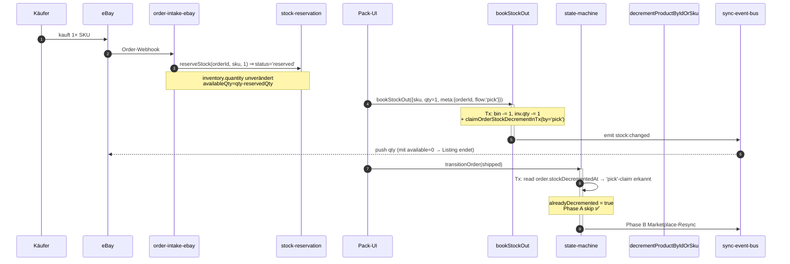

# Stock Single Source of Truth — Inventory-Mutations-Architektur

> **Status:** Verbindlich seit 2026-04-29 (Incident SKU-0000108900 + SKU-0000041030).
> **Querverweis:** [`CLAUDE.md`](../../CLAUDE.md) Punkte 10–13.

## TL;DR

Für jede physische Einheit `(sku × order)` darf `products_v2.inventory.quantity` während des Order-Lifecycle **GENAU EINMAL** dekrementiert werden. Welcher der beiden zulässigen Pfade greift, wird über den Idempotency-Marker `orders/{orderId}.stockDecrementedAt` koordiniert.

## Hintergrund — was schiefgelaufen ist

**Incident 2026-04-29:** Zwei eBay-Orders (jeweils qty=1) verursachten zwei Decrements `inventory.quantity = 2 → 1 → 0`, anschließend ungewollte Listing-Beendigung obwohl physisch noch 1 Stück vorhanden war.

**Sequenz:**
1. Mitarbeiter klickt im Pick-UI „Stock-Out" mit Order-Bezug → `bookStockOut(meta.orderId=O1, sku, 1)` setzt Bin-Qty 2→1 UND `inventory.quantity = 1`.
2. Sync-Bus pusht `available = 0` an eBay → Listing wird **ended**.
3. Eine Stunde später beim Versand triggert State-Machine `_onOrderShipped(O1)` → `decrementProductByIdOrSku(sku, 1)` setzt Bin-Qty 1→0 UND `inventory.quantity = 0`.

Zwei orthogonale Mutations-Domänen, kein gemeinsamer Idempotency-Mechanismus, kein gemeinsames Lock.

## Drei Mutations-Domänen — abgegrenzt

| # | Domäne | Trigger | Zweck | Decrementiert `inventory.quantity`? |
|---|---|---|---|---|
| 1 | **WMS / Operativ** | UI-Aktion (Stow, Pick, Bin-Move, manuelle Korrektur) | Physische Lager-Bewegung | Nur wenn keine Order-Referenz. Mit Order-Referenz → siehe Pfad A unten. |
| 2 | **Order-Lifecycle** | State-Machine `transitionOrder('shipped'\|'cancelled')` | Wirtschaftlicher Decrement bei Versand | Ja, via `decrementProductByIdOrSku` (Pfad B). |
| 3 | **Marketplace-Reconciliation** | Manueller Drift-Fix oder Sync-Reconcile | Korrektur bei detektierter Drift | Niemals direkt — muss über Pfad A oder Pfad B routen. |

## Die zwei zulässigen Decrement-Pfade

### Pfad A — Pick-with-Order (`bookStockOut` mit `meta.orderId`)

**Wann:** Mitarbeiter pickt physisch beim Pack-Tisch, bestätigt im UI mit Order-ID.

**Was:**
1. In Firestore-Tx: Bin `products[sku].quantity -= qty`, optional Bin-Eintrag entfernen wenn 0.
2. In derselben Tx: `products_v2/{id}.inventory.quantity` aktualisieren (auf neue Bin-Sum).
3. **In derselben Tx**: `orders/{orderId}` claimen via `claimOrderStockDecrementInTx({tx, orderRef, by: 'pick', skus})` — setzt `stockDecrementedAt`, `stockDecrementedBy='pick'`, `stockDecrementedSkus=[...]`.
4. Nach Tx-Commit: `notifyStockChange()` → `inventory_ledger` Eintrag.
5. Marketplace-Sync via `sync-event-bus` (push neue qty).

**Code:** [`backend/lib/warehouse.js bookStockOut`](../../backend/lib/warehouse.js).

### Pfad B — Ship-Decrement (`_onOrderShipped` → `decrementProductByIdOrSku`)

**Wann:** State-Machine `transitionOrder('shipped')` wird aufgerufen (Sendcloud-Webhook, manuelles Mark-Shipped).

**Was:**
1. State-Machine prüft via Atomic-Tx-Claim, ob `order.stockDecrementedAt` schon gesetzt ist:
   - **Schon gesetzt** (z.B. durch Pfad A) → `alreadyDecremented = true` → Phase A skip, nur Phase B (Marketplace-Sync) läuft.
   - **Noch nicht gesetzt** → atomarer Claim mit `stockDecrementedBy='ship'`, dann Phase A.
2. Phase A: `decrementProductByIdOrSku(sku, qty)` decrementiert Bins (FIFO über `storageBins[]`) UND `inventory.quantity`.
3. Nach Tx-Commit: `notifyStockChange()` → `inventory_ledger` Eintrag.
4. Phase B: Marketplace-Sync via `syncStockWithRetry`.

**Code:** [`backend/services/order-state-machine.js _onOrderShipped`](../../backend/services/order-state-machine.js).

## Sequence-Diagramm (Happy Path eBay-Order)



## Idempotency-Marker auf `orders`

```ts
{
  stockDecrementedAt: ISO_STRING,         // Wann der Decrement stattfand
  stockDecrementedBy: 'pick' | 'ship',    // Welcher Pfad ihn ausgeführt hat
  stockDecrementedSkus: string[],         // Liste aller dekrementierten SKUs
}
```

- Wird **nur** über `claimOrderStockDecrementInTx()` gesetzt (zentrale Helper-Funktion).
- Gelöscht (`FieldValue.delete()`) **nur** im Rollback-Pfad von `_onOrderShipped`, wenn ALLE Decrements fehlschlugen.
- Niemals direkt über `orderRef.update()` setzen oder löschen.

## Verbotene Pfade

| # | Pfad | File:Line | Warum verboten |
|---|---|---|---|
| F1 | Direkter `inventory.quantity`-Write außerhalb `lib/warehouse.js` / `lib/product-store.js` | u.a. `backend/routes/marketplace.js:966` (Gap C) | Umgeht Marker, Lock, Telemetrie. |
| F2 | `bookStockOut` mit `meta.orderId` ohne Claim | (entfällt — durch Code-Fix erzwungen) | Doppel-Decrement durch State-Machine garantiert. |
| F3 | `decrementProductByIdOrSku` aufrufen ohne State-Machine-Claim | (nur via `_onOrderShipped`) | Idempotency wird umgangen. |
| F4 | Stock-Mutation ohne `notifyStockChange` | u.a. `restockItem` (Gap D) | `inventory_ledger` bleibt blind. |
| F5 | Manuelle Korrektur via `set({merge:true})` aus Scripts ohne `--allowWarehouseFields` Guard | (siehe `lib/firestore.js:2387`) | Kein Audit-Trail. |

## Telemetrie-Garantien

| Mutation | Schreibt nach | Schreibt nach |
|---|---|---|
| `bookStockIn` | `warehouseEvents{type:'stock_in'}` | `inventory_ledger{reason:'stock-in'}` |
| `bookStockOut` (manuell) | `warehouseEvents{type:'stock_out'}` | `inventory_ledger{reason:'manual-stock-out'}` |
| `bookStockOut` (Pfad A) | `warehouseEvents{type:'stock_out', meta.orderId}` + `orders.stockDecrementedAt` | `inventory_ledger{reason:'pick-stock-out:<orderId>'}` |
| `decrementProductByIdOrSku` (Pfad B) | `warehouseEvents{type:'order_decrement'}` | `inventory_ledger{reason:'ship-decrement:<orderId>'}` |
| `assignProductToBin` / `removeProductFromBin` / `transferStock` | `warehouseEvents{type:'bin_*'}` | `inventory_ledger{reason:'bin-*'}` (TODO Gap A) |

Jede Mutation MUSS in beide Telemetrien schreiben. Wenn `inventory_ledger` leer ist obwohl Mutation stattfand: **Bug-Indikator**.

## Tests die diese Invarianten schützen

- `backend/__tests__/stock-pick-then-ship-no-double-decrement.test.js` — Pfad A → Pfad B Idempotenz.
- `backend/__tests__/stock-shipped-idempotency.test.js` — Pfad B Doppel-Aufruf-Idempotenz.
- `backend/__tests__/stock-failure-drain.test.js` — Drain-Worker.
- `backend/__tests__/stock-change-events.test.js` — `notifyStockChange`.
- `backend/__tests__/oversell-invariant.test.js` — statischer Code-Guard.

## Ausstehend (siehe TASKS.md)

- **Gap A:** `refreshProductInventory` Diff-Check ist post-Tx broken → `inventory_ledger` bleibt im Hot-Path leer (separates Ticket).
- **Gap C:** `routes/marketplace.js:966` Direct-Write Refactor.
- **Gap D:** `restockItem` echter Restock (Returns).
- **Gap E:** `stock-lock.js` Firestore-Backend-Implementierung.
- **Gap F:** `_onOrderCancelled` symmetrischer Re-Increment.

## Kontakt

Bei Verstößen gegen diese Architektur: Pull-Request mit Subject-Prefix `stock!:`, Reviewer + Operator informieren.
