# Was ist AvyCloud

> **Vision:** Eine Operations-Zentrale, die KMU-Händlern im DACH-Raum erlaubt, Produkte mit KI-Hilfe einmal sauber zu erfassen und auf allen relevanten Marktplätzen ohne Tool-Wechsel zu verkaufen.

## Value-Proposition (in einem Satz)

AvyCloud konsolidiert Produktanlage, Listings, Lager, Bestellungen, Versand, Retouren und Rechnungen in einer Software, mit Gemini-gestützter Produkterkennung als operatives Herzstück.

## Zielgruppe

| Merkmal | Wert |
|---------|------|
| Region | DACH (Deutschland, Österreich, Schweiz) |
| Sortimentsgröße | 50–5.000 SKUs |
| Reifegrad | KMU-Händler die manuell oder mit Insellösungen arbeiten |
| Marktplatz-Mix heute | eBay, Kaufland (Amazon + OTTO geplant, siehe [TASKS.md](../../../TASKS.md) Feature Backlog) |
| Sprachen | Deutsch im UI, deutsche Marktplatz-Compliance (GPSR) |

## Was AvyCloud kann

| Funktion | Beschreibung | Quelle in der KB |
|----------|--------------|------------------|
| **Identify** | KI-Pipeline (Gemini) erkennt Produkte aus Bildern, schlägt Titel/Kategorie/Aspects/Preis vor. V3 + V4 Pipeline. | [02-architecture/adr/0004-identify-v3-v4-cascade.md](../02-architecture/adr/0004-identify-v3-v4-cascade.md) |
| **Listing** | Auto-Veröffentlichung auf eBay + Kaufland mit Validierungen, eBay-Auto-Fix bei Publish-Fehlern, Required-Aspect-Enforcement. | [CLAUDE.md](../../../CLAUDE.md) §eBay Auto-Fix |
| **OMS** (Order Management) | Marktplatz-Intakes, State-Machine mit zentralem `transitionOrder()`, idempotente Status-Übergänge. | [02-architecture/adr/0003-oms-state-machine.md](../02-architecture/adr/0003-oms-state-machine.md) |
| **Warehouse** | BIN-Verwaltung, Pick/Pack-Workflows, Reservierungen, FIFO-Decrement, Single-Writer-Invariant. | [11-rules-and-invariants/stock-single-writer.md](../11-rules-and-invariants/stock-single-writer.md) |
| **Shipping** | SendCloud-Integration (Multi-Carrier: DHL, DPD, GLS, …), Tracking-Push zurück an Marktplatz. | [backend/lib/integration-registry.js](../../../backend/lib/integration-registry.js) |
| **Returns** | Marktplatz-Returns ziehen + lokale Bearbeitung, Refund-Push, geplanter Restock. | [backend/services/returns-engine.js](../../../backend/services/returns-engine.js) |
| **Invoicing** | Automatische Rechnungsstellung über SevDesk, Import bestehender SevDesk-Rechnungen. | [backend/services/invoice-engine.js](../../../backend/services/invoice-engine.js) |
| **Chat-Assistant** | Gemini-3-Chat im Produkt-Datenblatt für Recherche, Korrekturen und Updates (V3 → V2 → Legacy Cascade). | [02-architecture/adr/0005-chat-v3-cascade.md](../02-architecture/adr/0005-chat-v3-cascade.md) |

## Warum: Konsolidierung statt 5 Tools

Ein typischer DACH-Händler in der Zielgruppe nutzt heute parallel:

- ein PIM oder Excel für Stammdaten,
- ein Marktplatz-Tool (z. B. plentymarkets, JTL, Billbee) für Listings + Orders,
- eine Versandsoftware (SendCloud direkt, Shipcloud),
- ein Buchhaltungs-Frontend (SevDesk, lexoffice),
- ein KI-/Recherche-Tool (Vendoo, ChatGPT) für die Produktrecherche.

Jede Datensynchronisation zwischen diesen Tools ist eine Fehlerquelle, jeder Toolwechsel kostet Zeit. AvyCloud liefert diese Funktionsbausteine in **einer Single-Page-App**, mit einem konsistenten Datenmodell (`products_v2`, `orders`, `shipments`, `returns`, `invoices`) und einem internen Event-Bus, der Synchronisation in Echtzeit triggert.

## Differenzierung gegen bestehende Lösungen

| Wettbewerber | Ihr Schwerpunkt | Was AvyCloud anders macht |
|--------------|-----------------|---------------------------|
| **plentymarkets / PlentyONE** | Vollumfängliches ERP, sehr konfigurationslastig, hohe Einstiegshürde | Schlanke SaaS, KI-first, DACH-fokussiert. Keine wochenlange Implementierungsphase. |
| **JTL-Wawi** | Desktop-Software, on-prem, viele Plugins | Cloud-native (Firebase + Cloud Run), kein lokaler Server, keine Plugin-Welt. |
| **Billbee** | Multi-Channel-Order-Management mit Versandanbindung | AvyCloud bringt KI-Produkterkennung als zentralen Workflow mit. Identify ist nicht Add-on, sondern Kernfunktion. |
| **Vendoo** | KI-Listing-Tool für Cross-Listing (USA-Fokus, Poshmark/Mercari/eBay-US) | AvyCloud auf deutsche Marktplätze (eBay-DE, Kaufland) + deutsche Compliance (GPSR-Herstellerdaten Pflicht) ausgerichtet. |

## User-Journey vom Bild zum verkauften Produkt

```mermaid
flowchart LR
    User["Händler"] -->|Bilder hochladen| Capture["Erfassen-View"]
    Capture -->|Gemini Identify V4/V3| Pipeline["Identify-Pipeline"]
    Pipeline -->|Datasheet + Confidence| Sheet["Produkt-Datenblatt"]
    Sheet -->|Chat-Assistent korrigiert| Sheet
    Sheet -->|Save| V2["products_v2"]
    V2 -->|Listing-Pipeline| MP["eBay + Kaufland"]
    MP -->|Käufer bestellt| Intake["order-intake"]
    Intake -->|reserveStock| Reservation["stock_reservations"]
    Intake -->|order:created| Bus["sync-event-bus"]
    Reservation -->|Pack-UI| Pick["bookStockOut Pfad A"]
    Pick -->|transitionOrder shipped| State["order-state-machine"]
    State -->|SendCloud Label| Ship["Versand"]
    Ship -->|Tracking-Push| MP
    Ship -->|invoice-engine| Invoice["SevDesk Rechnung"]
```

## Verweise

- Detaillierte System-Architektur: [02-architecture/system-overview.md](../02-architecture/system-overview.md).
- Glossar aller Begriffe: [glossary.md](glossary.md).
- Marktpositionierung: [docs/product-strategy/positioning.md](../../product-strategy/positioning.md) *(Annahme — separate Strategie-Doku, nicht in diesem Patch berührt)*.
