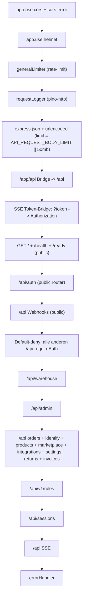

# Backend-Architektur

> Verifiziert gegen [backend/index.js](../../../backend/index.js), [backend/package.json](../../../backend/package.json), [backend/Dockerfile](../../../backend/Dockerfile), [backend/cloudbuild.yaml](../../../backend/cloudbuild.yaml).

## Tech-Stack

| Layer | Wert |
|-------|------|
| Runtime | Node.js `>=18.0.0` (Image: `node:20-slim` per [backend/Dockerfile](../../../backend/Dockerfile)) |
| Modul-System | CommonJS (`require` / `module.exports`) |
| HTTP-Framework | Express `^4.19.2` |
| Security | `helmet ^8.1.0`, `express-rate-limit ^8.2.1`, eigenes CORS-Setup |
| Logging | `pino ^10.3.1` + `pino-http ^11.0.0` |
| DB-SDK | `@google-cloud/firestore ^7.11.0`, `firebase-admin ^12.7.0` |
| Storage | `@google-cloud/storage ^7.14.0` |
| Secrets | `@google-cloud/secret-manager ^5.6.0` |
| Auth-Helper | `google-auth-library ^10.5.0` |
| KI | `@google/genai ^1.46.0`, `@google/generative-ai ^0.24.1` |
| Validierung | `zod ^4.4.3`, `ajv ^8.17.1`, `ajv-formats ^3.0.1` |
| Parsing | `fast-xml-parser`, `csv-parse`, `xlsx`, `stream-json` |
| File-Handling | `multer`, `sharp`, `pdfkit`, `qrcode` |
| Geo / UA | `geoip-lite`, `ua-parser-js` |
| Queue | `p-queue ^9.0.0` |
| Mail | `nodemailer ^6.9.16` |
| Tests | `vitest ^4.0.18`, `supertest ^7.2.2` |

## Start-Skript und Memory-Limit

[backend/package.json](../../../backend/package.json):

```
"start": "node --max-old-space-size=3584 index.js"
```

3 584 MB Old-Space matchen das Cloud-Run-Memory-Limit (3 GiB) abzüglich V8-Overhead. Wer das Limit lokal überschreitet, sieht Out-of-Memory-Aborts.

## Mount-Order der Router (verifiziert in [backend/index.js](../../../backend/index.js))



**Wichtige Reihenfolge-Details:**

- `webhooksRouter` wird **vor** `requireAuth` gemountet — Webhooks sind Machine-to-Machine und validieren signaturbasiert. Bekannter Hardening-Gap: nicht alle Webhook-Handler validieren die Signatur (siehe [11-rules-and-invariants/webhook-policies.md](../11-rules-and-invariants/webhook-policies.md)).
- Default-Deny-Middleware (`requireAuth`) lässt nur `OPTIONS`, `/api/image-proxy` und `/api/ebay/oauth/callback` durch.
- Body-Limit ist großzügig (50 MB Default) wegen Bild-Uploads im Erfassen-Flow. Override via ENV `API_REQUEST_BODY_LIMIT`.

## Runner und Cron-Loops (verifiziert in [backend/index.js](../../../backend/index.js))

### Startup-Runner (sofort beim Boot)

| Runner | Datei | Zweck |
|--------|-------|-------|
| `startJobRunner` | [backend/services/job-runner.js](../../../backend/services/job-runner.js) | Identify-Jobs ausführen |
| `startImproveRunner` | [backend/services/improve-runner.js](../../../backend/services/improve-runner.js) | Improve-Pipeline |
| `startQualityRunner` | [backend/services/quality-runner.js](../../../backend/services/quality-runner.js) | Quality-Gate-Jobs |
| `startRulebookRunner` | [backend/services/rulebook-runner.js](../../../backend/services/rulebook-runner.js) | Rule-Engine |
| `startAdminBulkRunner` | [backend/services/admin-bulk-runner.js](../../../backend/services/admin-bulk-runner.js) | Bulk-Aktionen (z. B. `recategorize_v2`) |
| `startPricingRunner` | [backend/services/pricing-runner.js](../../../backend/services/pricing-runner.js) | Pricing-Vorschläge |
| `startListingSyncRunner` | [backend/services/listing-sync-runner.js](../../../backend/services/listing-sync-runner.js) | Listing-Sync (eBay/Kaufland) |
| `startCompetitorRefreshRunner` | [backend/services/competitor-refresh-runner.js](../../../backend/services/competitor-refresh-runner.js) | Wettbewerber-Preise refreshen |

Jeder optionale Runner ist in einem `try { … } catch` gekapselt — fail-soft, blockiert den Start nie.

### Safety-Net Cron-Loops (in `server.listen`-Callback)

Aus [backend/index.js](../../../backend/index.js):

| Job | Intervall | ENV-Override | Erste Ausführung nach Boot |
|-----|-----------|--------------|----------------------------|
| `backgroundSyncOrders` (order-source-router) | 6 h | `ORDER_SYNC_INTERVAL_MS` | 10 s |
| `returns-sync` | 6 h | `RETURNS_SYNC_INTERVAL_MS` | 60 s |
| `sendcloud-sync` | 6 h | `SENDCLOUD_SYNC_INTERVAL_MS` | 90 s |
| `tracking-catchup` | 2 h | fix | 120 s |
| `delivery-poll` | 2 h | fix | 150 s |
| `invoice-sync` (SevDesk import + bulk generate) | 24 h | fix | 5 min |
| `refund-push` | 4 h | fix | 180 s |
| `kaufland-listings-sync` | 15 min | `KAUFLAND_LISTINGS_SYNC_INTERVAL_MS` | 210 s |
| `reservation-cleanup` | 5 min | `RESERVATION_CLEANUP_INTERVAL_MS` | 30 s |
| `stock-reconciliation` (activity) | 30 min | `RECONCILIATION_INTERVAL_MS` | 4 min |
| `stock-reconciliation` (full scan) | täglich 03:00–03:29 | fix | n/a |
| `stock-failure-drain` | 2 min | `STOCK_FAILURE_DRAIN_INTERVAL_MS` | 60 s |
| `restock-alert` | 2 h | `RESTOCK_ALERT_INTERVAL_MS` | 5 min |

**Background-Jobs-Multi-Tenant-Fan-Out:** sechs der Cron-Loops (returns-sync, sendcloud-sync, tracking-catchup, delivery-poll, invoice-sync, refund-push, kaufland-listings-sync) laufen durch `runForEachBackgroundJobTenant()` aus [backend/lib/background-job-tenants.js](../../../backend/lib/background-job-tenants.js). ENV `BACKGROUND_JOB_TENANTS` (Komma-separiert) steuert den Fan-Out. Default leer → Single-Tenant `'default'`. Siehe [multi-tenancy.md](multi-tenancy.md).

**Stock-Failure-Drain** nutzt davon abweichend `STOCK_FAILURE_DRAIN_TENANTS` (Default `'trendocean'`) — siehe [backend/index.js](../../../backend/index.js) Z. 511.

## Pre-Flip-Gate für `IDENTIFY_V4`

[backend/index.js](../../../backend/index.js) Z. 48ff: Wenn `IDENTIFY_V4=true` und `IDENTIFY_V4_CRITIC_HINTS_VERIFIED!=true`, wird beim Start eine WARN-Zeile geloggt (NIE Throw / Exit) + optionaler Slack-Alert via `SLACK_ALERTS_URL`. Operator muss zuvor [docs/runbooks/identify-v4-promotion.md](../../runbooks/identify-v4-promotion.md) lesen.

## Default-Initialisierung

Beim Start werden parallel ausgeführt:

| Aufruf | Zweck |
|--------|-------|
| `ensureDefaultRoles()` | Default-Rollen `admin`, `manager`, `operation`, `catalog` in `roles`-Collection seedn. |
| `ensureBootstrapAdmin()` | Bootstrap-Admin-User anlegen (Email aus `AUTH_BOOTSTRAP_ADMIN_EMAIL`). |
| `ensureDefaultLlmScopes()` | LLM-Scopes seeden (`chat.product`, `identify.v2`, `improve.product`, `quality.gate`, `image.generation`, …) — siehe [docs/standards/llm-quality-parity.md](../../standards/llm-quality-parity.md). |
| `ensureDefaultLlmScopeVersions()` | Pro Scope eine `v-default-…` Version aktivieren. |

## Cloud-Run-Deploy

[backend/cloudbuild.yaml](../../../backend/cloudbuild.yaml):

| Parameter | Wert |
|-----------|------|
| Region | `europe-west3` |
| Service-Name | `product-hub-backend` |
| Memory | 3 GiB |
| CPU | 2 |
| Min Instances | 1 |
| Timeout | 600 s |
| Public | `--allow-unauthenticated` (Auth in App-Layer) |
| Stets gesetzte ENV | `USE_PRODUCTS_V2=true` |

Build-Schritte:
1. `node --check index.js` (Syntax-Smoke).
2. `npm ci --omit=dev` im `backend/`.
3. Motorcycle-ePID-Dataset generieren ([backend/scripts/extract-moto-epid-jsonl.js](../../../backend/scripts/extract-moto-epid-jsonl.js)).
4. `node --check` für `lib/title-policy.js` + `services/product-chat.js`.
5. Docker-Image bauen + pushen (zwei Tags: `latest` + `$_TAG`).
6. `gcloud run deploy`.

Detail: [04-deployment/backend-deploy.md](../04-deployment/backend-deploy.md).

## Graceful Shutdown

[backend/index.js](../../../backend/index.js) Z. 557ff: `SIGTERM` → `server.close()` mit 10 s Force-Kill-Timer. Cloud-Run-Standard für Scale-Down.
