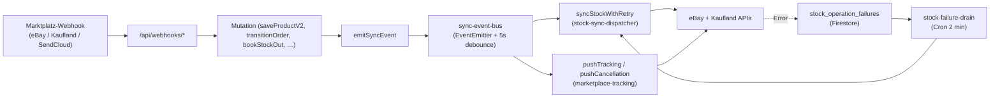

# Eventing-Architektur

> Geprüfte Quellen: [backend/services/sync-event-bus.js](../../../backend/services/sync-event-bus.js), [backend/index.js](../../../backend/index.js).

## TL;DR

In-process `EventEmitter` als zentraler Sync-Dispatcher. Jede Datenmutation feuert ein Event, das Sync-Worker reagieren lässt. Cron-Loops sind nur **Safety-Net** für verlorene Events. Eine persistente Outbox ist im Hardening-Plan vorgesehen, aber heute *nicht* implementiert.

## Architektur

[backend/services/sync-event-bus.js](../../../backend/services/sync-event-bus.js):

```js
const bus = new EventEmitter();
bus.setMaxListeners(50);
// Debounce per entity to prevent duplicate syncs within 5s
const DEBOUNCE_MS = 5000;
```

| Eigenschaft | Wert |
|-------------|------|
| Transport | Node.js `events.EventEmitter` (in-process) |
| Max Listeners | 50 |
| Debounce | 5 s pro `(event, entityId)` |
| Error-Isolation | Jeder Handler `try/catch` — ein Fehler blockt andere nicht |
| Persistenz | **keine** — bei Cloud-Run-Restart gehen pending Events verloren |
| Scale-out | Bei ≥2 Cloud-Run-Instanzen sehen Worker nur ihre eigenen Events |

## Event-Katalog

| Event | Payload | Effekte (Handler in [backend/services/sync-event-bus.js](../../../backend/services/sync-event-bus.js)) |
|-------|---------|--------------------------------------------------------------------------------------------------------|
| `order:created` | `{ entityId, tenantId, source }` | `syncStockForOrderItems` (Safety-Net) + debounced marketplace-order-sync. |
| `order:status_changed` | `{ entityId, tenantId, fromStatus, toStatus, source }` | Stock-Sync, Reservierung-Release (wenn cancelled), Marketplace-Cancel-Push (cancelled), Tracking-Push-Check (shipped), debounced marketplace-sync. |
| `order:updated` | `{ entityId, tenantId }` | debounced marketplace-order-sync. |
| `return:created` | `{ entityId, tenantId }` | debounced returns-sync. |
| `return:status_changed` | `{ entityId, tenantId, toStatus }` | Stock-Sync wenn restocked (`erstattet`/`teilweise_erstattet`) + debounced returns-sync. |
| `shipment:created` | `{ entityId, tenantId }` | debounced sendcloud-sync. |
| `shipment:updated` | `{ entityId, tenantId, statusId }` | Bei Status `15/32/33` returns-sync, sonst sendcloud-sync. |
| `stock:changed` | `{ entityId (productId), tenantId, reason }` | `syncStockWithRetry` für alle Marketplace-Channels. |

## Event-Flow



## Debounce-Verhalten

Pro `(event:entityId)`-Key wird `_lastEmitMs` getrackt. Innerhalb des 5-Sekunden-Fensters wird ein Trailing-Timer geplant (mindestens 25 ms später) der den Event nach Fensterablauf nachholt. So bekommen Hot-Mutationen (z. B. fünfmal Picking auf derselben Order) am Ende genau einen Sync — der letzte aktuelle State.

## Aggregat-Syncs (zusätzliche Debounces)

Im Modul existieren zusätzlich debounced Wrapper für Channel-übergreifende Sync-Calls (`_debouncedMarketplaceOrderSync`, `_debouncedReturnSync`, `_debouncedSendCloudSync`) — diese Schicht verhindert API-Hammering wenn viele Order-/Return-Events im Burst feuern.

## Safety-Net Cron-Jobs

Aus [backend/index.js](../../../backend/index.js) im `server.listen`-Callback (siehe [backend.md](backend.md) §Safety-Net Cron-Loops). Sie fangen alles ein, was das in-process Eventing nicht erreichen konnte:

- Cloud-Run-Restart vor Event-Verarbeitung.
- Webhook-Delivery-Failure des Marktplatzes.
- Network-Fehler beim Sync.

**Wichtiger Hinweis:** Die Pflicht-Kette „Stock-Mutation → `emitSyncEvent('stock:changed', …)` → bei Fehlschlag landet das in `stock_operation_failures` → Drain-Worker retried" ist explizit in Punkt 10 [CLAUDE.md](../../../CLAUDE.md) verankert.

## Geplante Erweiterung: Outbox-Pattern

Heutiger Zustand: in-process EventEmitter. Bei Crash zwischen Mutation und Handler-Ack ist der Event verloren — kompensiert durch:
- Cron Safety-Net (6 h Order-Sync, 6 h Returns-Sync, 15 min Kaufland-Listings, …).
- `stock_operation_failures` + Drain-Worker für Stock-Pfad.

Ziel-Architektur (im Hardening-Plan, Quelle: [CLAUDE.md](../../../CLAUDE.md) §Weiterführende Regeln verweist auf `/Users/oguz/.claude/plans/avycloud-roadmap-nachhaltig.md`):
- Persistente `outbox` Collection in Firestore. Jede Mutation schreibt in derselben Tx einen Outbox-Eintrag.
- Dedizierter Outbox-Drain-Worker dispatcht zum Bus.
- Bei Crash bleiben Events persistent.
- Voraussetzung für horizontale Skalierung (≥2 Cloud-Run-Instanzen).

> **Status:** Plan, noch nicht implementiert. Glossar-Eintrag „Outbox" in [01-overview/glossary.md](../01-overview/glossary.md).

## Verweise

- Stock-Architektur: [docs/architecture/stock-single-source-of-truth.md](../../architecture/stock-single-source-of-truth.md).
- OMS-State-Machine: [adr/0003-oms-state-machine.md](adr/0003-oms-state-machine.md).
- Drain-Worker: [backend/services/stock-failure-drain.js](../../../backend/services/stock-failure-drain.js).
