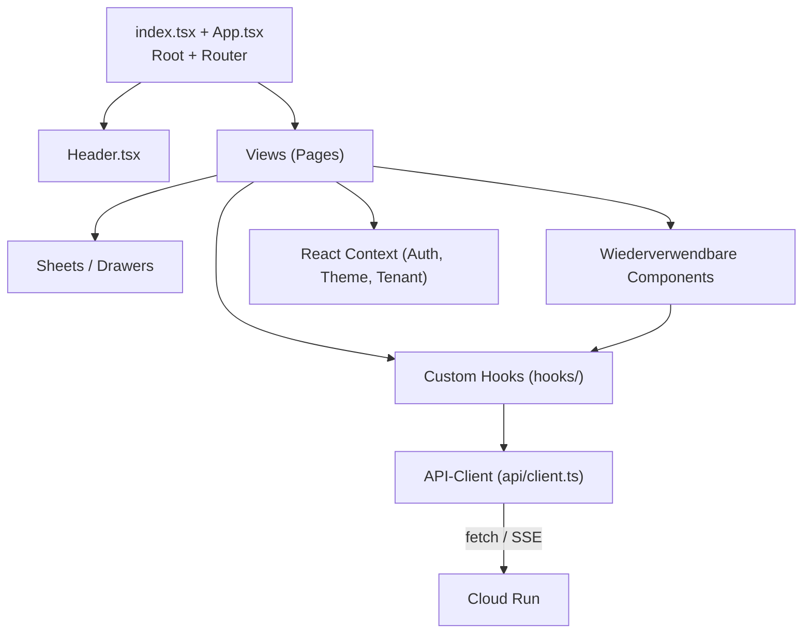

# Frontend-Architektur

## Tech-Stack (verifiziert in [package.json](../../../package.json))

| Layer | Bibliothek | Version (per `package.json`) | Zweck |
|-------|-----------|------------------------------|-------|
| Runtime | React | `^18.2.0` | UI-Framework |
| Sprache | TypeScript | `^5.0.0` | Type-Safe Frontend (ESM) |
| Build | Vite | `^4.4.0` | Dev-Server + Bundler |
| Styling | Tailwind CSS | `^3.4.15` | Utility-First CSS, Design-Tokens |
| Auth + DB-SDK (clientseitig) | `firebase` | `^10.14.1` | Sign-In + Token-Bezug |
| Server-State | `@tanstack/react-query` | `^5.97.0` | Cache, Background-Refetch, Mutations |
| Forms | `react-hook-form` | `^7.71.2` | Formular-State + Validierung |
| Animationen | `framer-motion` | `^10.16.4` | View-Transitions, Sheet-Animations |
| Charts | `recharts` | `^3.7.0` | Dashboard- und Pricing-Charts |
| Gemini SDK | `@google/genai` + `@google/generative-ai` | `^1.30.0` / `^0.1.0` | Browser-seitige Hilfs-Calls (z. B. Vorschau-Embeddings) |
| Bild-Tools | `@imgly/background-removal`, `@zxing/browser`, `html5-qrcode` | n/a | Background-Removal-Preview, Barcode-Scanner |
| HTML-Safety | `dompurify` | `^3.3.2` | Sanitization für KI-Output im Datenblatt |

> **Hinweis:** `playwright` ist als Dev-Dependency installiert (Annahme: für lokale Smoke-Tests). Eine E2E-Test-Suite ist heute *nicht* aktiv eingebunden — siehe Backlog in [TASKS.md](../../../TASKS.md) („E2E-Tests (Playwright)").

## Build-Konfiguration

| Aspekt | Wert |
|--------|------|
| Dev-Server | `npm run dev` → Vite auf Port `3000` ([vite.config.ts](../../../vite.config.ts)) |
| Production-Build | `npm run build` → erzeugt `dist/` ([package.json](../../../package.json)) |
| TS-Settings | `target: ESNext`, `module: ESNext`, `moduleResolution: Node`, `strict: true`, `jsx: react-jsx` ([tsconfig.json](../../../tsconfig.json)) |
| TS-Include | `App.tsx`, `index.tsx`, `components/**`, `hooks/**`, `api/**`, `constants.ts`, `types.ts` ([tsconfig.json](../../../tsconfig.json)) |
| Hosting | Firebase Hosting Site `avycloud`, Public Folder `dist`, SPA-Rewrite `**` → `/index.html` ([firebase.json](../../../firebase.json)) |
| Cache-Header | `service-worker.js` + `index.html` mit `no-cache`. JS/TS-Endpoints korrekt mit `text/javascript` (Workaround für Firebase-Hosting-MIME). Statische Bilder `max-age=7200`. ([firebase.json](../../../firebase.json)) |

## Komponenten-Hierarchie

**Konkrete Komponenten** (Auszug aus `components/`):

| Komponente | Aufgabe |
|------------|---------|
| `Dashboard.tsx` / `DashboardMobile.tsx` | Haupt-Dashboard mit Hero-KPIs + Pipeline. |
| `GeminiChat.tsx` | Chat-Drawer im Datenblatt (V3/V2/Legacy-Cascade). |
| `IdentifyQueueView.tsx`, `IdentifyV4Badge.tsx`, `IdentifyHealthTile.tsx` | Identify-Flow + Status-Anzeige. |
| `ImportModal.tsx`, `IntegrationWizard.tsx` | Setup-Wizards für Marketplaces. |
| `AuditLogView.tsx`, `ErrorDashboard.tsx` | Operator-Sichten. |
| `DeduplicationView.tsx` | Duplikate aus `products_v2` bereinigen. |
| `AttributeTable.tsx`, `CategoryManagement.tsx` | Eigenschaften / Kategorie-Pflege. |

**Custom Hooks** (Auszug aus `hooks/`):

| Hook | Aufgabe |
|------|---------|
| `useIdentification` / `useIdentificationQueue` | Identify-Flow + Queue-Status. |
| `useImproveQueue` | Improve-Pipeline-Status. |
| `useOrders`, `useListings`, `useInventories` | React-Query-Wrapper für die Haupt-Collections. |
| `useChatStream`, `useSSE`, `useProductStream`, `useJobStream` | SSE-Streams für Long-Running Jobs + Chat. |
| `useBarcodeScanner` | Hardware-Scanner für Pick/Pack im Lager. |
| `useBulkUpdate`, `useGridEdit` | Inline-Edits im Inventar. |
| `usePricingRules`, `usePricingSuggestion` | Pricing-Engine-Anbindung. |
| `useSessionTracking` | Telemetrie (GPU, Akku, Speicher, Pointer — siehe TASKS.md „Session Tracking"). |
| `useErrors`, `useValidation` | Fehler-Sammlung + Pre-Listing-Validation. |
| `useRules` | Rule-Engine. |

## State-Management

- **Server-State**: `@tanstack/react-query` für jede API-Call. Hooks unter `hooks/` kapseln Cache-Keys und Query-Fns.
- **Client-State**: lokaler `useState` / `useReducer` in Views; übergreifender Zustand (Auth-User, Theme, Tenant) via React Context.
- **Forms**: `react-hook-form` für komplexere Formulare (Produkt-Datenblatt, Settings).
- **SSE**: dedizierte Hooks (`useSSE`, `useChatStream`, `useJobStream`) öffnen EventSource-Verbindungen. Token wird via `?token=<jwt>` in der URL übertragen (Backend bridge in [backend/index.js](../../../backend/index.js) Z. 209ff), da EventSource keine Custom-Header setzen kann.

## UI-Token-System

Verbindlich aus [CLAUDE.md](../../../CLAUDE.md):
- Nur Design-Tokens (`bg-accent`, `text-muted`) — **keine** rohen Tailwind-Farben (`bg-blue-500`).
- Token-Definitionen leben in `styles/main.css` *(Annahme — Pfad nicht in dieser Doku-Charge gegenchecked; siehe [03-development/code-style.md](../03-development/code-style.md)).*

## Hosting-Header und Edge-Behavior

Aus [firebase.json](../../../firebase.json):

| Pfad | Header |
|------|--------|
| `/service-worker.js`, `/index.html` | `Cache-Control: no-cache, no-store, must-revalidate` (verhindert stale SPA-Shells). |
| `**/*.{js,jsx,ts,tsx}` | Explicit `Content-Type: text/javascript; charset=utf-8` (Workaround für Firebase-MIME-Inkonsistenzen). |
| `**/*.{jpg,jpeg,gif,png,webp,avif}` | `Cache-Control: public, max-age=7200`. |

## Deploy

Push auf `main` → [.github/workflows/firebase-hosting.yml](../../../.github/workflows/firebase-hosting.yml) baut + deployt. Detail: [04-deployment/frontend-deploy.md](../04-deployment/frontend-deploy.md).
