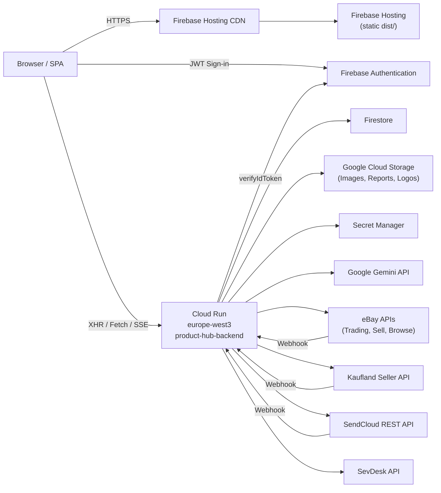
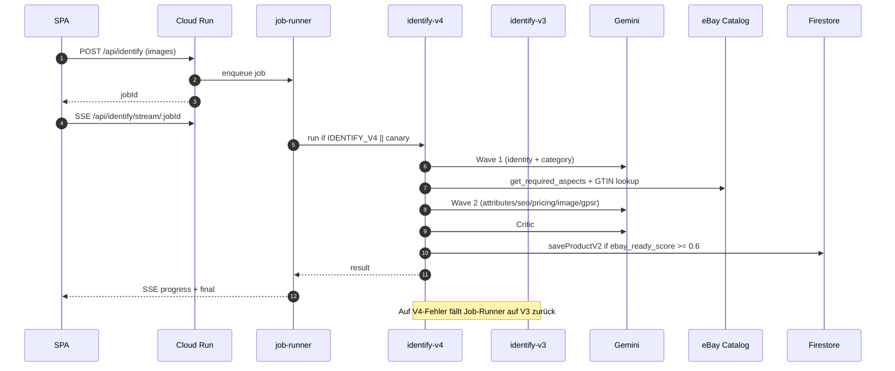
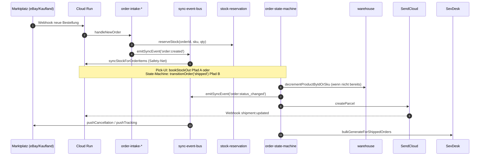

# System-Overview

> Das Big-Picture: welche Komponente wohin spricht. Detail-Verweise in den jeweiligen Sub-Dokumenten ([frontend.md](frontend.md), [backend.md](backend.md), [data-layer.md](data-layer.md), [eventing.md](eventing.md)).

## Komponenten-Diagramm

## Verantwortlichkeiten pro Komponente

| Komponente | Verantwortung | Quelle |
|------------|---------------|--------|
| **Browser / SPA** | UI-Rendering, Auth-Sign-in, Optimistic Updates via React-Query, SSE-Streams für Identify/Improve. | [App.tsx](../../../App.tsx) (Annahme — Repo-Root SPA-Entry) |
| **Firebase Hosting** | Statisches Hosting der Vite-Build-Artefakte (`dist/`), CDN-Distribution, SPA-Rewrites. | [firebase.json](../../../firebase.json) |
| **Cloud Run** | Express-API, 3 GiB / 2 vCPU, `--min-instances 1`, `--timeout 600`, Region `europe-west3`. | [backend/cloudbuild.yaml](../../../backend/cloudbuild.yaml) |
| **Firestore** | Primärdatenbank für Produkte (`products_v2`), Orders, Returns, Shipments, Invoices, Audit, Ledger. | [backend/lib/firestore.js](../../../backend/lib/firestore.js) |
| **Google Cloud Storage** | Bilder, Reports (`recategorize_v2`), Logos, Cassini-Reports. | [backend/cloudbuild.yaml](../../../backend/cloudbuild.yaml) (impliziert via `@google-cloud/storage` Dependency) |
| **Secret Manager** | API-Keys für eBay, Kaufland, SendCloud, SevDesk, Gemini. | [backend/lib/integration-registry.js](../../../backend/lib/integration-registry.js) (Feld `secretKeys`) |
| **Gemini API** | Identify-Pipelines (V3/V4), Chat (V3/V2/Legacy), Quality-Gate, Stage-3-Content, Image-Enhance, Critic. | [docs/standards/llm-callers-inventory.md](../../standards/llm-callers-inventory.md) |
| **eBay** | Listings, Orders-Intake, Order-Updates, Tracking-Push, Required-Aspects-Lookup. | [backend/lib/integration-registry.js](../../../backend/lib/integration-registry.js) §`ebay` |
| **Kaufland** | Listings, Orders-Intake, Stock-Push, Tracking-Push. | [backend/lib/integration-registry.js](../../../backend/lib/integration-registry.js) §`kaufland` |
| **SendCloud** | Versandlabels (DHL, DPD, GLS, …), Tracking-Updates, Delivery-Polling. | [backend/services/shipping-engine.js](../../../backend/services/shipping-engine.js) |
| **SevDesk** | Rechnungs-Generierung + Import existierender Rechnungen. | [backend/services/invoice-engine.js](../../../backend/services/invoice-engine.js) |
| **Firebase Authentication** | E-Mail/Passwort, Token-Issue, `verifyIdToken` im Backend. | [backend/lib/auth.js](../../../backend/lib/auth.js) |

## Datenfluss: Identify

## Datenfluss: Order

## Querverweise

- Komponenten im Detail: [frontend.md](frontend.md), [backend.md](backend.md), [data-layer.md](data-layer.md), [eventing.md](eventing.md).
- Stock-Mutations-Architektur: [11-rules-and-invariants/stock-single-writer.md](../11-rules-and-invariants/stock-single-writer.md).
- Auth + Tenant: [auth-and-rbac.md](auth-and-rbac.md), [multi-tenancy.md](multi-tenancy.md).
- ADRs: [adr/](adr/).
