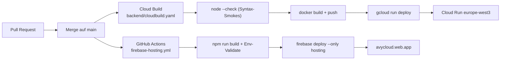

# CI/CD Pipeline-Überblick

> Beide Pipelines triggern auf `main` und laufen unabhängig voneinander.

## Pipeline-Übersicht

## Frontend-Pipeline ([.github/workflows/firebase-hosting.yml](../../../.github/workflows/firebase-hosting.yml))

| Gate | Was wird geprüft |
|------|------------------|
| Required-Vars-Check | `VITE_FIREBASE_API_KEY`, `VITE_FIREBASE_AUTH_DOMAIN`, `VITE_FIREBASE_PROJECT_ID`, `VITE_FIREBASE_APP_ID` müssen gesetzt sein. |
| Backend-URL-Format | Origin-only (kein Path/Query/Hash) für `VITE_BACKEND_URL` und `VITE_BACKEND_FALLBACK_URLS`. |
| Build | `npm run build` (Vite). |
| Deploy | `FirebaseExtended/action-hosting-deploy@v0` mit `channelId: live`. |

Detail: [frontend-deploy.md](frontend-deploy.md).

## Backend-Pipeline ([backend/cloudbuild.yaml](../../../backend/cloudbuild.yaml))

| Gate | Was wird geprüft |
|------|------------------|
| Syntax-Smoke `index.js` | `node --check index.js` |
| `npm ci --omit=dev` | Production-Deps installieren |
| Motorcycle-ePID Dataset | wird in den Build-Output gebacken |
| Syntax-Smoke `lib/title-policy.js` + `services/product-chat.js` | Catch von typischen Runtime-`ReferenceError` |
| Docker-Build + Push | zwei Tags (`$_TAG`, `latest`) |
| `gcloud run deploy` | Cloud-Run-Deploy mit gepinnten Flags |

Detail: [backend-deploy.md](backend-deploy.md).

## Bekannte Gaps

> **Wichtig:** Keine der beiden Pipelines führt heute Tests aus. Das ist ein bewusst dokumentierter Hardening-Gap.

| Gap | Beschreibung | Quelle |
|-----|--------------|--------|
| **Keine Backend-Tests im CI** | `backend/cloudbuild.yaml` macht nur `node --check` für 3 Files. `cd backend && npm test` läuft **nicht** im Build. | [backend/cloudbuild.yaml](../../../backend/cloudbuild.yaml) |
| **Keine Frontend-Type-Checks im CI** | `npm run build` läuft, aber `tsc --noEmit` fehlt. Type-Errors werden vom Bundler nicht immer abgefangen. | [.github/workflows/firebase-hosting.yml](../../../.github/workflows/firebase-hosting.yml) |
| **Keine E2E-Tests** | Playwright ist als Dev-Dep installiert, aber im CI nicht eingebunden. Backlog-Item in [TASKS.md](../../../TASKS.md) §Backlog (Someday): „E2E-Tests (Playwright)". |
| **Kein Lint-Gate** | Keine ESLint/Prettier-Konfiguration im geprüften Pfad aktiv im CI. **Muss verifiziert werden** für Frontend. |
| **Kein Schema-Audit-Gate** | `backend/scripts/audit-kb-coverage.js` ist als CI-Check vorgesehen ([docs/kb/00-INDEX.md](../00-INDEX.md)), läuft heute aber nicht automatisiert. |

**Konsequenz für Developer und Coding-Agents:** Lokales `cd backend && npm test` + `npm run build` ist Pflicht vor Push, weil das CI keinen Test-Gate hat. Siehe Post-Flight in [AGENTS.md](../../../AGENTS.md).

Tracking: siehe [TASKS.md](../../../TASKS.md) (Backlog (Someday)-Block + neue Hardening-Tickets bei Bedarf). Der detaillierte Hardening-Plan liegt in `/Users/oguz/.claude/plans/avycloud-roadmap-nachhaltig.md` *(extern, muss verifiziert werden)*.

## Build-Artefakte

| Pipeline | Artefakt | Wo |
|----------|----------|-----|
| Frontend | `dist/` | Wird direkt zu Firebase Hosting deployed (kein Artifact-Storage). |
| Backend | `gcr.io/$PROJECT_ID/product-hub-backend:{$_TAG,latest}` | Google Container Registry. |

## Build-Dauer (Beobachtungswerte, geschätzt — **muss verifiziert werden**)

| Pipeline | Typische Dauer |
|----------|----------------|
| Frontend | 2–4 min (npm install + vite build + hosting deploy) |
| Backend | 4–7 min (npm ci + docker build + push + cloud-run deploy) |

## Rollback

Siehe [rollback.md](rollback.md).

## Verweise

- Frontend-Deploy: [frontend-deploy.md](frontend-deploy.md).
- Backend-Deploy: [backend-deploy.md](backend-deploy.md).
- ENV-Vars: [env-vars.md](env-vars.md).
