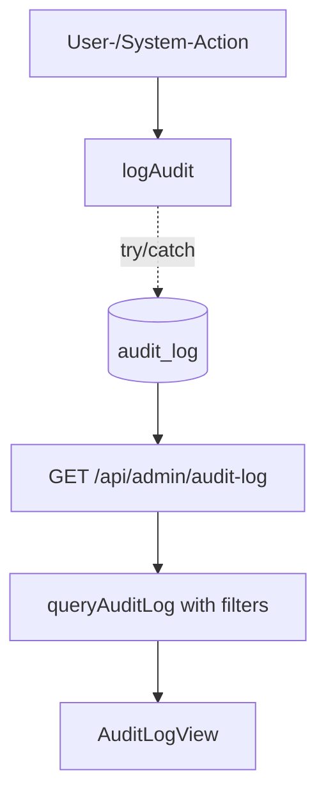

# Audit Log

## Was es macht

Schreibt strukturiert sicherheits- und änderungs-relevante User- und System-Aktionen nach `audit_log` Firestore-Collection für Nachvollziehbarkeit und Compliance. Wird über `logAudit({ action, userId, userEmail, tenantId, resourceType, resourceId, details, ip })` aus `backend/services/audit-log.js` aufgerufen. Fire-and-forget — wirft NIE Errors, blockiert NIE den Hauptflow.

## Wie es funktioniert



### Schreibpfad (`backend/services/audit-log.js`)

```js
await logAudit({
  action: 'product.created',          // z. B. 'product.merged', 'order.status_changed', 'rule.executed'
  userId,
  userEmail,
  tenantId: 'default',
  resourceType: 'product' | 'order' | 'listing' | 'user' | 'rule' | …,
  resourceId,
  details: { /* old/new values, counts, … */ },
  ip,
});
```

`timestamp` wird automatisch als ISO-String gesetzt. Failures werden nur per `console.error` geloggt — die Hauptlogik darf nicht durch Audit-Failures abbrechen.

### Abfrage-API (`backend/services/audit-log.js#queryAuditLog`)

Filter:
- `tenantId` (Pflicht)
- `userId`, `action`, `resourceType`, `resourceId`
- Zeit-Bereich (`from`, `to`)
- Pagination (`limit`, `cursor`)

### Diff-Helper

`diffProduct(before, after)` aus `services/audit-log.js` wird in `backend/routes/products.js` genutzt, um Vorher/Nachher-Werte für Produkt-Updates zu berechnen — Output landet in `details`.

### Aufrufer (Auswahl)

- `backend/routes/products.js` — Produkt-Mutationen, Bulk-Updates
- `backend/routes/orders.js` — Order-Transitions, Bulk-Ship
- `backend/routes/rules.js` — Rule create/update/delete/execute
- `backend/routes/admin.js` — Admin-Aktionen, RBAC-Änderungen
- (Weitere Routen über `require('../services/audit-log')`)

## Code-Pfade

**Backend:**
- `backend/services/audit-log.js` — `logAudit`, `queryAuditLog`, `diffProduct`
- `backend/routes/admin.js`:
  - `GET /api/admin/audit-log` (auth: `admin.read`)
- Aufrufer: `routes/products.js`, `routes/orders.js`, `routes/rules.js`, `routes/admin.js`

**Frontend:**
- `components/AuditLogView.tsx` — Tabellarische Anzeige mit Filter (User, Action, Resource, Zeitraum)
- `components/admin/AdminPanel.tsx` — bindet `AuditLogView` ein

### Datenmodell

| Collection | Zweck |
|---|---|
| `audit_log` | Append-only Audit-Trail |

| Feld | Typ | Beschreibung |
|---|---|---|
| `action` | string | z. B. `product.created`, `order.status_changed` |
| `userId` | string | Firebase UID |
| `userEmail` | string | Display-Email |
| `tenantId` | string | Multi-Tenancy |
| `resourceType` | string | `product`/`order`/`rule`/`user`/`listing`/… |
| `resourceId` | string | ID der betroffenen Resource |
| `details` | object | Old/New-Werte oder Zusatzkontext |
| `ip` | string | Request-IP |
| `timestamp` | ISO-string | Schreibzeit |

## Feature-Flags

Keine dedizierten ENV-Flags. Audit-Log ist immer aktiv.

## API-Endpoints

Verweis auf `docs/kb/09-api/` (TBD).

- `GET /api/admin/audit-log` (auth: `admin.read`) — Query mit Filtern, Cursor-Pagination

## UI-Pages

Verweis auf `docs/kb/05-pages/` (TBD).

- AdminPanel → Audit-Log-Tab via `AuditLogView`

## Spec

TBD — keine Stand-alone-Spec.

## Bekannte Issues

TBD — laufende Bugs siehe `TASKS.md`.
