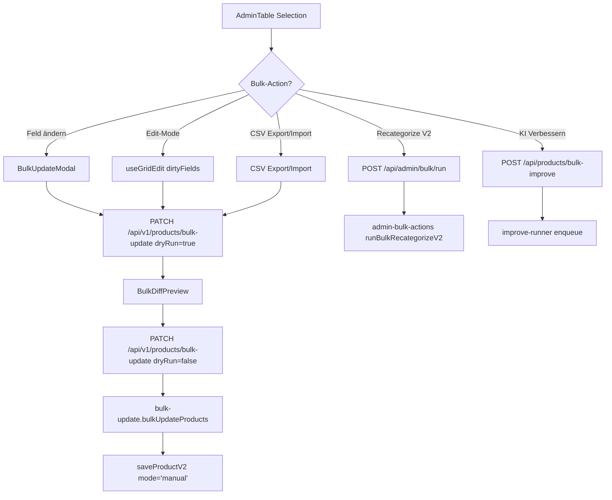

# Bulk Editing

## Was es macht

Erlaubt Sellern, mehrere Produkte gleichzeitig zu bearbeiten: Bulk-Field-Update (Preis/Lager/Kategorie/Name/Status), Inline-Grid-Editing, CSV-Export/-Import, sowie Action-Bulk-Operations (KI Verbessern, Re-Categorize-V2, Title-Fix, Delete). Jede Schreib-Operation läuft über `saveProductV2({ mode: 'manual' })`.

## Wie es funktioniert

### Layer 1 — Bulk Field Update

`backend/services/bulk-update.js` liest pro Produkt das aktuelle Datenblatt, merged Feld-Pfade (deep, z. B. `details.pricing.lowest_price.amount`), und schreibt via `saveProductV2()`.

- `dryRun: true` → returns `diff: [{productId, changes:[{field, oldValue, newValue}], status}]` ohne Schreiben.
- `dryRun: false` → returns `{updated, skipped, errors[], duration_ms}`.
- Limit: 500 Produkte pro Call.
- Skip-Detection: gleicher Wert → `status='skipped'`.

### Layer 2 — Inline Grid Editing

`hooks/useGridEdit.ts` hält `dirtyFields: Map<productId, Record<field, value>>`. `EditableCell` schaltet pro Cell zwischen Read/Edit. Tab/Enter/Escape-Keyboard-Nav. Beim "Speichern" wird der Diff in das gleiche `bulk-update`-Format konvertiert und mit DryRun-Preview committed.

### Layer 3 — CSV Export/Import

- Export: `lib/csv-export.js` (UTF-8 BOM, nested Field-Paths flattened).
- Import: `lib/csv-import.js` (parsing + Column-Mapping + DryRun via `bulkUpdateProducts({dryRun:true})`).
- Endpoints: `GET /api/v1/products/export/csv`, `POST /api/v1/products/import/csv` (multipart, max 10 MB).

### Action-Bulk-Operations (`backend/services/admin-bulk-actions.js`)

Aktionen die **mehr als ein Field-Update** sind, laufen als Admin-Bulk-Job:
- `recategorize_v2` — siehe `recategorize-v2.md`
- `batch_optimize` — `services/batch-optimize.js` (alles via Gemini Chat-V2 mit dem "Alles optimieren"-Prompt, sequenziell mit `BATCH_OPTIMIZE_DELAY_MS` Rate-Limit)
- `bulk-improve` — fan-out zu `improve-runner` (siehe `improve-pipeline.md`)
- weitere Aktionen: Title-Fix, Highlights-Fix, Description-Fix etc.

Jeder Job schreibt Audit-Logs nach `admin_job_runs` und optional nach GCS (Bucket `STORAGE_BUCKET || 'prodsandjobs'`) — `summary.json` + `dryrun_repairs.json`/`apply_repairs.json`.

## Code-Pfade

**Backend:**
- `backend/services/bulk-update.js` — Core Bulk-Update + DryRun
- `backend/services/batch-optimize.js` — "Alles optimieren" Bulk via Chat-V2
- `backend/services/admin-bulk-actions.js` — Action-Switcher (`recategorize_v2`, `batch_optimize`, …)
- `backend/services/admin-bulk-runner.js` — Job-Runner für Admin-Bulk-Jobs
- `backend/lib/admin-bulk-jobs.js` — Job-Storage (`admin_job_runs` Collection)
- `backend/lib/admin-job-runs.js` — Helpers
- `backend/routes/products.js`:
  - `PATCH /api/v1/products/bulk-update`
  - `GET /api/v1/products/export/csv`
  - `POST /api/v1/products/import/csv`
  - `POST /api/products/bulk-delete`
  - `POST /api/products/bulk-improve`
  - `POST /api/products/bulk/run`
  - `GET /api/products/bulk/jobs/:id`
- `backend/__tests__/services/bulk-update.test.js` — Unit-Tests
- `backend/__tests__/batch-optimize.test.js` — Batch-Optimize-Tests

**Frontend:**
- `components/AdminTable.tsx` — Hauptlist + Selection
- `components/admin-table/BulkActions.tsx` — Persistent Action-Bar
- `components/admin-table/BulkUpdateModal.tsx` — Field-Selector + DryRun
- `components/admin-table/BulkDiffPreview.tsx` — Diff-Tabelle (Reusable)
- `components/admin-table/EditableCell.tsx` — Inline-Edit-Cell
- `components/admin-table/AdminTableHeader.tsx` — Select-All-Filtered
- `components/admin-table/AdminTableRow.tsx`
- `components/admin/AdminBulkActions.tsx` — Admin-Bulk-Run-Trigger
- `hooks/useBulkUpdate.ts`, `hooks/useGridEdit.ts`

## Feature-Flags

| Flag | Default | Wirkung |
|---|---|---|
| `BATCH_OPTIMIZE_DELAY_MS` | `3000` | Delay zwischen Bulk-Optimize-Produkten (Gemini-Quota-Schutz) |
| `STORAGE_BUCKET` | `prodsandjobs` | GCS-Bucket für Audit-Reports |
| `IMPROVE_QUEUE_CONCURRENCY` | `2` | Bei `bulk-improve`-fan-out (siehe `improve-pipeline.md`) |

## API-Endpoints

Verweis auf `docs/kb/09-api/` (TBD).

- `PATCH /api/v1/products/bulk-update` (Layer 1) — `productIds[]` (max 500), `updates[]`, `dryRun?`
- `GET   /api/v1/products/export/csv` (Layer 3) — `?columns=…&productIds=…`
- `POST  /api/v1/products/import/csv` (Layer 3) — multipart `file`, `dryRun?`
- `POST  /api/products/bulk-delete` (auth: `products.delete`)
- `POST  /api/products/bulk-improve` (auth: `ai.improve`)
- `POST  /api/products/bulk/run` (auth: `products.write`) — Admin-Bulk-Runner-Trigger
- `GET   /api/products/bulk/jobs/:id` — Job-Status
- `POST  /api/admin/bulk/run` — Admin-Bulk-Action-Switcher (siehe `recategorize-v2.md`)

## UI-Pages

Verweis auf `docs/kb/05-pages/` (TBD).

- AdminTable (`/products`) — Multi-Select, BulkActions-Bar, Edit-Mode, CSV-Export/Import.
- Admin-Bulk-Runs (`AdminBulkActions.tsx`) — Trigger der admin-level Bulk-Aktionen.

## Spec

- [archivierte BULK-001-Spec](../../archive/features/completed/BULK-001-bulk-editing-spec.md) — Drei-Layer-Spec mit kompletter Build-Sequenz.

## Bekannte Issues

TBD — laufende Bugs siehe `TASKS.md`.
