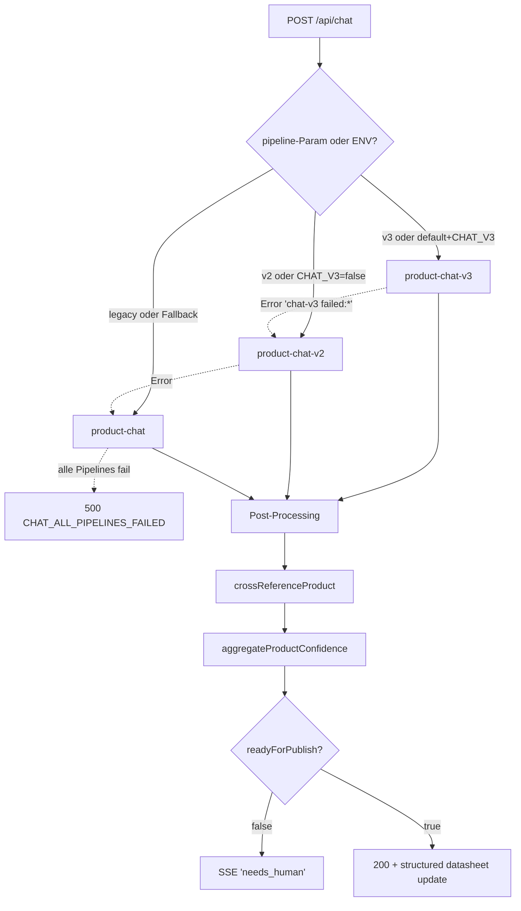

# Chat Assistant

## Was es macht

Produkt-Recherche-Assistent im ProductSheet. Aus minimalem Input (Bild + MPN + Marke) schlägt der Assistent eBay-ready Datenblatt-Änderungen vor — Titel, Beschreibung, Highlights, Attribute, Bilder. Drei Pipelines stehen in einer Fallback-Cascade zur Verfügung: **V3** (Gemini 3 Context Circulation, default-on), **V2** (Google Search Grounding), **Legacy** (BrightData/SerpAPI).

## Wie es funktioniert

### Pipeline-Details

**V3 — `backend/services/product-chat-v3.js`** (default-on, Code-Default `chatV3Enabled()` `true`):
- Gemini 3.1 Pro Customtools mit `googleSearch + urlContext + atomic-tools + update_product_datasheet + suggest_product_images` in einem Request.
- `FunctionCallingConfigMode.ANY` mit `allowedFunctionNames=['update_product_datasheet']` erzwingt finalen Write-Call (verhindert Research-Attractor-Loop).
- Atomic-Tools (executors in `backend/services/atomic-tools.js`): `lookup_gtin`, `search_ebay_catalog`, `get_required_aspects`, `verify_brand`, `search_amazon_product`, `search_manufacturer_site`, `fetch_url_content`.
- Generation Config: Temperature 1.0, `thinking_level='high'`, `includeThoughts=true`, `maxOutputTokens=12000`, `mediaResolution='HIGH'`.

**V2 — `backend/services/product-chat-v2.js`** (default-on Fallback):
- Google Search Grounding + custom function declarations.
- Mit `CHAT_V2_ENHANCED=true` (default): urlContext, Temperature 1.0, Thinking-Mode, `mediaResolution=HIGH`.

**Legacy — `backend/services/product-chat.js`** (Last-Resort-Fallback):
- BrightData + SerpAPI external tools.
- Mit `CHAT_LEGACY_ENHANCED=true` (default): ASIN-Detection, Amazon-Routing via SerpAPI `engine='amazon'`, forceOneEvidencePass für alle Intents (nicht nur `change`), Thinking-Mode.

### Post-Processing

1. `crossReferenceProduct(draft, sourceResults)` aus `backend/lib/cross-reference.js` — Konsens aus 2+ Quellen, normalisiert Werte (GTIN digits-only, Brand strip GmbH).
2. `aggregateProductConfidence(fieldScores)` aus `backend/lib/confidence-scoring.js` — Per-Field-Threshold-Check mit Multi-Source-Boost und Disagreement-Penalty.
3. Wenn `readyForPublish === false` → SSE-Event `needs_human`.

### Confidence-Thresholds

`gtin/ean/upc=0.95`, `categoryId=0.85`, `brand=0.90`, `mpn=0.85`, `title=0.70`, `description=0.60`, `requiredAspects=0.80`, `price=0.70`, `weight=0.70`, `gpsr=0.75`.

## Code-Pfade

**Backend:**
- `backend/services/product-chat-v3.js` — V3-Orchestrator (Gemini 3 Context Circulation)
- `backend/services/product-chat-v2.js` — V2-Pipeline (Google Search Grounding)
- `backend/services/product-chat.js` — Legacy-Pipeline (BrightData + SerpAPI)
- `backend/services/atomic-tools.js` — Function Declarations + Executors
- `backend/lib/confidence-scoring.js` — Per-Field-Thresholds + Aggregation
- `backend/lib/cross-reference.js` — Source-Konsens (`SOURCE_WEIGHTS`)
- `backend/lib/gemini-config.js` — Defaults (Model, Temperature, Thinking, Safety)
- `backend/lib/gemini3-client.js` — `@google/genai` SDK-Client
- `backend/lib/prompt-cache.js` — Gemini Context Caching (LRU)
- `backend/lib/llm-config.js` — Scope-Config-Resolver (`resolveScopeConfig`)
- `backend/lib/llm-prompts/scopes/chat-context.json` — Scope-Defaults (Model-Override `GEMINI_CHAT_MODEL`)
- `backend/lib/chat-sessions.js` — Session-State (Memory)
- `backend/routes/identify.js` — `POST /api/chat`, `GET/DELETE /api/chat/session/:productId`

**Frontend:**
- `components/GeminiChat.tsx` — Chat-UI im ProductSheet (rechte Spalte)

## Feature-Flags

| Flag | Default | Wirkung |
|---|---|---|
| `CHAT_V3` | `true` (Code-Default in `product-chat-v3.js#chatV3Enabled()`) | V3-Master-Switch. `false` → V2 zuerst |
| `CHAT_V2_ENHANCED` | `true` | V2-Härtungen (urlContext, Temperature 1.0, Thinking) |
| `CHAT_LEGACY_ENHANCED` | `true` | Legacy-Härtungen (Amazon-Routing, forceEvidencePass, Thinking) |
| `CHAT_GROUNDING` | `true` | V2-Grounding-Pipeline aktiv (Fallback hinter V3) |
| `CHAT_MODEL` | – | Optionaler Override des Default-Chat-Models |
| `INTENT_MODEL` | – | Override für Intent-Detection-Model |
| `GEMINI_CHAT_MODEL` | – | Scope-Config Override (`chat-context.json#defaultModelEnvKey`) |
| `GEMINI_PROMPT_CACHE` | `true` | Prompt-Caching für System-Prompts |
| `LLM_TELEMETRY_SAMPLE` | `0.1` | Sample-Rate für `llm_call_telemetry` |
| `LLM_SCHEMA_STRICT` | `false` | Stufe-1 safeparse-warn, Stufe-2 strict-throw |
| `LLM_SCHEMA_VALIDATE_RATE` | `1.0` | Sampling für Schema-Validation |

Per-Call-Override: `req.body.pipeline ∈ {v3, v2, legacy, auto}` — bei Pipeline-Error automatischer Fallback zur nächsten.

## API-Endpoints

Verweis auf `docs/kb/09-api/` (TBD). Aktuell:

- `POST /api/chat` — Chat-Request (auth: `ai.chat`, multipart-Upload erlaubt)
- `GET /api/chat/session/:productId` — Session laden
- `DELETE /api/chat/session/:productId` — Session reset

Routing in `backend/routes/identify.js:1326`.

## UI-Pages

Verweis auf `docs/kb/05-pages/` (TBD).

- ProductSheet → Chat-Tab/Panel via `GeminiChat`. Quick-Actions wie "Alles optimieren" senden vordefinierte Prompts.

## Spec

- [archivierte Chat-V3-Spec](../../archive/features/implemented-llm/chat-assistant-v3-spec.md) — V3-Spezifikation (Architektur, Tools, Post-Processing, Fallback-Chain).

## Bekannte Issues

TBD — laufende Bugs siehe `TASKS.md`.
