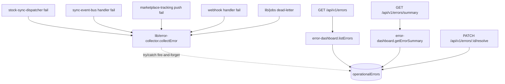

# Error Dashboard

## Was es macht

Zentralisiert alle operativen Fehler in der `operationalErrors` Firestore-Collection und stellt sie als filterbares Dashboard bereit. Quellen: Stock-Sync, Marketplace-API, Webhook-Verarbeitung, Job-Runner, Order-Intake. Sellers sehen Errors mit Severity, Channel, Entity-Link und Fix-Vorschlag. Erledigt-Markierung blendet auf, Sidebar-Badge zeigt offene Anzahl.

## Wie es funktioniert



### Collector (`backend/lib/error-collector.js`)

```js
collectError({
  tenantId, type, severity, channel, message,
  details?, entityType?, entityId?, entityName?, source?, status?, fixSuggestion?
});
```

- `VALID_TYPES`: `sync_failure | api_error | job_failure | validation_error | webhook_error`
- `VALID_SEVERITIES`: `critical | warning | info`
- `VALID_CHANNELS`: `ebay | kaufland | sendcloud | internal`
- Fire-and-forget: alle Logik in `try/catch`, NIE Throw, NIE blocking.
- `matchFixSuggestion(message)` Pattern-Matching:
  - `timeout / etimedout` → "API temporär nicht erreichbar — wird erneut versucht"
  - `ean … missing/fehlt` → "EAN fehlt — Produkt bearbeiten und EAN ergänzen"
  - `max retries / exhausted` → "Job fehlgeschlagen — Bild/Daten prüfen, erneut versuchen"
  - `signature / hmac` → "Webhook-Secret in Einstellungen prüfen"
  - `tracking` → "Tracking manuell im Marktplatz eintragen"

### Dashboard-Service (`backend/services/error-dashboard.js`)

- `listErrors({ tenantId, type, channel, severity, status, page, pageSize })` — bis 100/Seite, default 50.
- `getErrorSummary({ tenantId })` — Counts by `status / severity / type / channel`.
- `resolveError({ tenantId, errorId, resolvedBy })` — `status='resolved'` + `resolvedAt`/`resolvedBy`.

### Quellen

| Source | File | Integration |
|---|---|---|
| Stock-Sync | `backend/services/stock-sync-dispatcher.js` | `collectError()` bei Sync-Failure |
| Sync-Bus | `backend/services/sync-event-bus.js` | `collectError()` bei Handler-Failure |
| Tracking | `backend/services/marketplace-tracking.js` | `collectError()` bei Push-Failure |
| Webhooks | `backend/routes/webhooks.js` | `collectError()` bei Webhook-Failure |
| Jobs | `backend/lib/jobs.js` | `collectError()` beim Dead-Letter-Move |

## Code-Pfade

**Backend:**
- `backend/lib/error-collector.js` — Fire-and-forget Writer
- `backend/services/error-dashboard.js` — Query/Aggregation/Resolve
- `backend/routes/products.js` — 3 Endpoints für Errors (siehe unten)

**Frontend:**
- `components/ErrorDashboard.tsx` — Hauptseite
- `components/error-dashboard/ErrorKPIs.tsx` — KPI-Tiles
- `components/error-dashboard/ErrorList.tsx` — Liste mit Filter
- `components/error-dashboard/ErrorRow.tsx` — Einzel-Row mit Severity-Dot, Channel-Badge, Resolve-Action
- `hooks/useErrors.ts` — Fetch + 30 s-Polling für Sidebar-Badge

### Datenmodell

| Collection | Zweck |
|---|---|
| `operationalErrors` | `tenantId`, `type`, `severity`, `channel`, `message`, `details`, `entityType`, `entityId`, `entityName`, `source`, `status`, `fixSuggestion`, `createdAt`, `resolvedAt`, `resolvedBy` |

Indexe: `tenantId+status+createdAt(desc)`, `tenantId+type+status`, `tenantId+channel+status`. NFR: Collection-Cap 10 000 Docs/Tenant, TTL-Cleanup `resolved > 30 d`.

## Feature-Flags

Keine dedizierten ENV-Flags. `error-collector` ist immer aktiv.

## API-Endpoints

Verweis auf `docs/kb/09-api/` (TBD). Aktuell in `backend/routes/products.js`:

- `GET   /api/v1/errors` (auth: `products.read`) — Query mit Filter+Pagination
- `GET   /api/v1/errors/summary` (auth: `products.read`) — KPI-Counts
- `PATCH /api/v1/errors/:errorId/resolve` (auth: `products.write`) — Resolve

## UI-Pages

Verweis auf `docs/kb/05-pages/` (TBD).

- `/errors` → `ErrorDashboard`
- Sidebar-Eintrag "Fehler" mit Badge (rot, nur bei offenen Errors)

## Spec

- [archivierte ERR-001-Spec](../../archive/features/completed/ERR-001-error-dashboard-spec.md)

## Bekannte Issues

TBD — laufende Bugs siehe `TASKS.md`.
