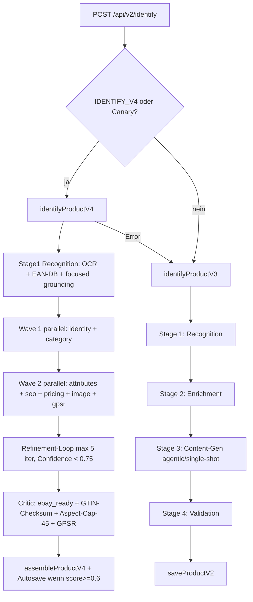

# Identify Pipeline (V3 + V4)

## Was es macht

Die Identify-Pipeline erzeugt aus minimalem Input (Bilder + optional Barcode/EAN) ein vollständiges, eBay-/Kaufland-qualifiziertes Produktdatenblatt. Zwei Pipeline-Generationen koexistieren: **V3** ist Default-On (Multi-Stage 1→4), **V4** ist als Orchestrator-Worker-Swarm implementiert und Default-Off (Dark-Deployed).

## Wie es funktioniert

### V3 — Multi-Stage Pipeline (Default)

| Stage | Datei | Aufgabe |
|---|---|---|
| Stage 1 | `backend/lib/identify-v3-stage1.js` | OCR, EAN-Lookup, fokussiertes Grounding, Image Quality Gate |
| Stage 2 | `backend/lib/identify-v3-stage2.js` | Anreicherung (Web-Lookups Gewicht/GPSR, Cross-Reference) |
| Stage 3 | `backend/lib/identify-v3-stage3.js` + `identify-v3-stage3-agentic.js` | Content-Gen (Titel, Beschreibung, Aspects). Agentic-Loop default-on. |
| Stage 4 | `backend/lib/identify-v3-stage4.js` + `identify-v3-evidence.js` | Validation, Cross-Reference, Quality-Score |

GPSR-Merge erfolgt in `services/identify-v3.js#assembleProduct()` mit Drei-Modi-Flag `IDENTIFY_V3_GPSR_CONSENSUS` (`false|shadow|true`).

### V4 — Orchestrator-Worker-Swarm (Dark-Deployed)

8 Domain-Worker laufen in 2 Wellen parallel, gefolgt von Refinement-Loop und Critic. Alle Worker liefern einheitliche Shape `{ok, domain, resolved, confidence, sources, retriesRequested, meta}` und `never throw`.

| Worker | Datei | Primäre Aufgabe |
|---|---|---|
| identity | `backend/lib/identify-workers/identity-worker.js` | GTIN/EAN/UPC/MPN + Brand Resolution |
| category | `backend/lib/identify-workers/category-worker.js` | eBay-Kategorie + Required Aspects |
| attributes | `backend/lib/identify-workers/attributes-worker.js` | Item Specifics, Aspect-Cap 45 |
| seo | `backend/lib/identify-workers/seo-worker.js` | Titel + HTML-Beschreibung |
| pricing | `backend/lib/identify-workers/pricing-worker.js` | Sweet-Spot-Preis (SOLD/Active/Amazon) |
| image | `backend/lib/identify-workers/image-worker.js` | Multi-Source-Bilder, BG-Removal, Upscale |
| gpsr | `backend/lib/identify-workers/gpsr-worker.js` | Hersteller-Compliance |
| critic | `backend/lib/identify-workers/critic-worker.js` | Quality-Gate + Fix-Hints |

Refinement-Loop konsumiert Critic-Hints (`critic.resolved.refinement_needed_workers`) zusätzlich zur Confidence-Detection (Sub-Flag `IDENTIFY_V4_CRITIC_HINTS`). Wave-1-Lock auf `identity`+`category` wird respektiert.

## Code-Pfade

**Backend:**
- `backend/services/identify-v3.js` — V3-Orchestrator + GPSR-Merge
- `backend/services/identify-v4.js` — V4-Orchestrator (Wave-Setup, Refinement-Loop, Autosave)
- `backend/services/identify-grounding.js` — V2-Fallback (Google Search Grounding)
- `backend/services/job-runner.js` — async Job-Queue für `/identify/jobs`
- `backend/lib/identify-v3-stage1.js` … `stage4.js` — Stage-Module
- `backend/lib/identify-v3-stage3-agentic.js` — Agentic Stage-3-Pipeline
- `backend/lib/identify-v3-evidence.js` — Stage-4 Cross-Reference
- `backend/lib/identify-workers/*.js` — 8 V4-Worker
- `backend/lib/sweet-spot-pricer.js`, `lib/seo-title-builder.js`, `lib/seo-description-builder.js`, `lib/aspect-cap-enforcer.js`, `lib/image-enhance.js`, `lib/ebay-sold-listings.js`, `lib/ebay-catalog.js` — Phase-A-Libraries (V4)
- `backend/services/atomic-tools.js` — Gemini Function Declarations (`lookup_gtin`, `search_ebay_catalog`, `get_required_aspects`, `verify_brand`, `search_amazon_product`, `search_manufacturer_site`, `fetch_url_content`)
- `backend/lib/identify-metrics.js` — Telemetrie-Counter
- `backend/routes/identify.js` — HTTP-Routen (`/api/v2/identify`, V4-Branch vor V3)
- `backend/services/category-resolver.js` — Category-Resolver-V2 (eBay Catalog GTIN → Taxonomy → Local → Gemini)

**Frontend:**
- `components/IdentifyV4Badge.tsx` — Badge `V4 83%` + Needs-Review-Banner
- `components/IdentifyHealthTile.tsx` — Health-Anzeige (`/api/health/identify`)
- `components/IdentifyQueueView.tsx` — Job-Queue-Ansicht
- `components/AdminIdentifyRunsDashboard.tsx` — Admin-Dashboard für Identify-Runs

**Scripts:**
- `backend/scripts/smoke-identify-v4.js` — Live-Smoke-Test gegen Gemini

## Feature-Flags

Master-Flags (Backend-ENV):

| Flag | Default | Wirkung |
|---|---|---|
| `IDENTIFY_V4` | `false` | Master-Switch V4. Default off = Dark-Deploy |
| `IDENTIFY_V4_CANARY_RATE` | `0` | Float 0..1, Canary-Anteil der V4 nutzt |
| `IDENTIFY_V4_CANARY_TENANTS` | `''` | Komma-Tenants die V4 erzwingen |
| `IDENTIFY_V4_AUTOSAVE` | `true` | Direkt via `saveProductV2` schreiben (≥ 0.6 score) |
| `IDENTIFY_V4_MAX_ITERATIONS` | `5` | Refinement-Loop-Limit |
| `IDENTIFY_V4_WAVE_TIMEOUT_MS` | `60000` | Timeout pro Wave |
| `IDENTIFY_V4_TIMEOUT_MS` | `180000` | Hard-Pipeline-Cap V4 |
| `IDENTIFY_V4_IMAGE_ENHANCE` | `true` | Gemini Image BG-Removal + Upscale |
| `IDENTIFY_V4_IMAGE_ANGLE_CLASSIFY` | `true` | Multi-Angle via Gemini Flash |
| `IDENTIFY_V4_PRICING_SOLD` | `true` | eBay SOLD-Listings nutzen |
| `IDENTIFY_V4_CRITIC_FLASH` | `true` | Critic darf Gemini-Flash für Fix-Hints |
| `IDENTIFY_V4_CRITIC_HINTS` | `true` | Refinement-Loop konsumiert Critic-Hints |
| `IDENTIFY_V4_CRITIC_HINTS_VERIFIED` | `false` | Promotion-Acknowledge bei Flip von `IDENTIFY_V4=true` |
| `IDENTIFY_V4_FALLBACK` | `v3` | Pipeline bei V4-Error |
| `IDENTIFY_V3` | `true` | V3 Master-Switch |
| `IDENTIFY_V3_GPSR_CONSENSUS` | `false` | `false`/`shadow`/`true` — GPSR-Merge-Modus |
| `IDENTIFY_TOTAL_TIMEOUT_MS` | `360000` | Master-Timeout `/api/v2/identify` |
| `IDENTIFY_GROUNDING` | `true` | V2-Grounding-Pipeline (Fallback) |
| `IDENTIFY_GROUNDING_TIMEOUT_MS` | `90000` | Grounding-Call-Timeout |
| `STAGE1_IMAGE_QUALITY_GATE` | `true` | Bild-Qualitäts-Analyse Stage 1 |
| `STAGE1_SKIP_FOCUSED_GROUNDING` | `false` | Emergency-Bypass Grounding-Outage |
| `STAGE1_SKIP_V2_FALLBACK` | `false` | Emergency-Bypass Doppel-Outage |
| `STAGE2_WEIGHT_WEB_FALLBACK` | `true` | Gewicht Web-Lookup |
| `STAGE2_GPSR_WEB_FALLBACK` | `true` | GPSR Web-Lookup |
| `STAGE3_AGENTIC` | `true` | Agentic Stage-3-Pipeline |
| `STAGE3_AGENTIC_SAMPLE` | `–` | 0..1 Canary (nur wenn `STAGE3_AGENTIC` unset) |
| `STAGE3_AGENTIC_MAX_ITERATIONS` | `5` | Tool-Loop-Limit |
| `STAGE3_AGENTIC_TIMEOUT_MS` | `90000` | Agentic-Total-Timeout |
| `STAGE3_AGENTIC_MAX_TOKENS` | `12000` | `maxOutputTokens` agentic |
| `STAGE3_AGENTIC_MAX_IMAGES` | `4` | Bilder im Initial-Prompt |
| `STAGE3_AGENTIC_SOFT_RESEARCH_LIMIT` | `3` | Research-Calls bevor Write gedrängt |
| `STAGE3_ASPECT_ENFORCEMENT` | `true` | Required-Aspects systematisch füllen |
| `STAGE3_ASPECT_REPAIR` | `true` | Repair-Call wenn >30 % "Unbekannt" |
| `CATEGORY_RESOLVER_V2` | `true` | Multi-Stage-Category-Resolver |
| `CATEGORY_RESOLVER_DYNAMIC_CONFIDENCE` | `true` | Dynamische Confidence statt hard-coded |
| `QUALITY_GATE_ENABLED` | `true` | Quality-Gate aktiv |
| `GEMINI_PROMPT_CACHE` | `true` | Prompt-Caching |

Komplette ENV-Liste mit Sub-Flags: siehe `CLAUDE.md`.

## API-Endpoints

Verweis auf `docs/kb/09-api/` (TBD). Aktuell relevant in `backend/routes/identify.js`:

- `POST /api/v2/identify` — Synchroner Identify-Run (V4 → V3 Cascade)
- `POST /api/v2/enrich` — Enrich-only auf bestehendem Produkt
- `POST /api/jobs` (`upload.array('images')`) — Async Job
- `GET /api/jobs/:id` — Job-Status
- `GET /api/jobs/:id/stream` — SSE-Stream
- `POST /api/jobs/:id/retry` — Retry
- `POST /api/identify` — Legacy-Single-Shot
- `GET /api/health/identify` — Aggregierte Pipeline-Health
- `GET /api/health/external-apis` — External-API-Tracker-Stats
- `POST /api/v2/group-images` — Image-Grouping

## UI-Pages

Verweis auf `docs/kb/05-pages/` (TBD).

- ProductSheet zeigt V4-Provenance via `IdentifyV4Badge` sobald `ops.data_quality.identify_v4` gesetzt ist.
- `IdentifyHealthTile` und `IdentifyQueueView` sind im Admin-Bereich erreichbar.

## Spec

- [docs/features/identify-v4/spec.md](../../features/identify-v4/spec.md) — V4-Spezifikation (Architektur, Worker-Details, Rollout-Plan).
- V3-Spec: TBD (V3 ist als Code-Pfad seit 2026-04 produktiv, Spec wurde nicht separat angelegt — `CLAUDE.md` ist Source of Truth).

## Bekannte Issues

TBD — laufende Bugs siehe `TASKS.md`. Bekannte Schuld: Kaufland-Reconcile in `routes/marketplace.js:966` mutiert `inventory.quantity` direkt (siehe Stock-Single-Writer-Invariante, `CLAUDE.md` Punkt 13 Gap C).
