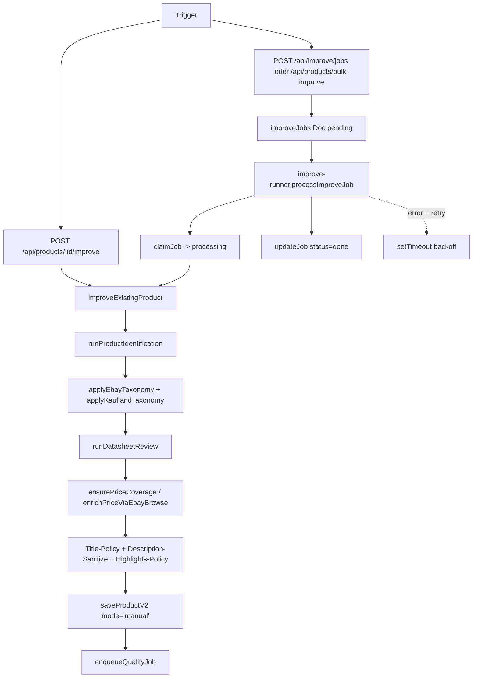

# Improve Pipeline

## Was es macht

Die Improve-Pipeline veredelt ein bereits in `products_v2` gespeichertes Produkt-Datenblatt: sie aktualisiert Identifikation, Kategorie, Pflicht-Aspects, Titel, Beschreibung, Highlights, Bilder und Preis-Evidenz mithilfe von Gemini-Recherche, eBay Browse Insights und Web-Unlocker-Lookups. Trigger: manuelle Quick-Action im UI oder Bulk-Ausführung. Async-Variante läuft als `improveJobs`-Queue mit p-queue.

## Wie es funktioniert

### Kernschritte in `improveExistingProduct(productId, onProgress)` (`backend/services/improve.js`)

1. `getProduct(productId)` — Lade aktuellen V2-Stand.
2. `runProductIdentification` — Re-Identifikation/Cross-Reference (Gemini + Web).
3. `applyEbayTaxonomy` / `applyKauflandTaxonomy` — Kategorie + Required-Aspects-Coverage.
4. `runDatasheetReview` — Titel/Beschreibung/Highlights/Attribute-Refinement.
5. `ensurePriceCoverage` + `enrichPriceViaEbayBrowseBestEffort` — Preis-Evidenz aus eBay Browse Samples (max 6 Quellen, Median, Confidence dynamisch).
6. `coerceTitleToPolicy`, `sanitizeDescriptionToHtml` — Policy-Anwendung.
7. `decodeHtmlEntitiesDeep` — Entity-Sanitization.
8. `saveProductV2(merged, { mode: 'manual' })` — Canonical Write-Path.
9. `enqueueQualityJob` — Post-Improve Quality-Gate (siehe `services/quality-gate.js`).

### Async-Job-Lifecycle (`backend/services/improve-runner.js`)

- p-queue mit Concurrency `IMPROVE_QUEUE_CONCURRENCY` (default 2).
- `claimJob(jobId)` setzt Status auf `processing`.
- Bei Fehler wird abhängig von `attempts < IMPROVE_JOB_MAX_ATTEMPTS` (default 2) ein Retry mit Backoff (`IMPROVE_JOB_BACKOFF_MS` × attempts) eingeplant.
- Sweeper läuft alle `IMPROVE_JOB_SWEEP_MS` (default 45 s) und re-enqueued pending Jobs.

### Job-Storage (`backend/lib/improve-jobs.js`)

- Collection `improveJobs`.
- Felder: `status` (`pending|processing|done|failed`), `stage`, `attempts`, `payload`, `result`, `error`, Timestamps.
- `sanitizeValue` entfernt `undefined` und respektiert `Timestamp` / `FieldValue`.

## Code-Pfade

**Backend:**
- `backend/services/improve.js` — Hauptlogik (`improveExistingProduct`, eBay Browse Price Enrich, Title-Insights)
- `backend/services/improve-runner.js` — p-queue Job-Runner + Sweeper + Backoff
- `backend/lib/improve-jobs.js` — Firestore-CRUD für `improveJobs` Collection
- `backend/services/enrichment.js` — `runProductIdentification`, `runDatasheetReview`, `applyEbayTaxonomy`, `applyKauflandTaxonomy`, `ensurePriceCoverage`
- `backend/lib/ebay-browse-title-insights.js` — `fetchCategoryTitleInsights`, `fetchBrowsePriceSamples`
- `backend/lib/listing-sanitize.js` — Description-HTML-Sanitization
- `backend/lib/title-policy.js` — Title-Policy
- `backend/lib/highlights-policy.js` — Highlights-Policy
- `backend/lib/web-unlocker.js` — `fetchWithUnlocker` für externe Recherche
- `backend/services/quality-runner.js` + `backend/lib/quality-jobs.js` — Post-Improve Quality-Gate
- `backend/routes/products.js`:
  - `POST /api/products/:id/improve` (sync)
  - `POST /api/improve/jobs` (async)
  - `POST /api/products/bulk-improve` (Bulk-Trigger)

**Frontend:**
- `components/ProductSheet.tsx` — Improve-Trigger via Quick-Action ("KI Verbessern")
- `components/admin-table/BulkActions.tsx` — Bulk-Improve-Button im AdminTable
- `components/JobStatusPopup.tsx` — Job-Status-Polling

## Feature-Flags

| Flag | Default | Wirkung |
|---|---|---|
| `IMPROVE_QUEUE_CONCURRENCY` | `2` | Parallel-Jobs pro Instanz |
| `IMPROVE_JOB_MAX_ATTEMPTS` | `2` | Max-Attempts vor `failed` |
| `IMPROVE_JOB_SWEEP_MS` | `45000` | Sweeper-Intervall für pending Jobs |
| `IMPROVE_JOB_BACKOFF_MS` | `30000` | Basis-Backoff zwischen Retries |
| `IMPROVE_REFERENCE_IMAGES` | `4` | Max Referenz-Bilder im Improve-Prompt |
| `BATCH_OPTIMIZE_DELAY_MS` | `3000` | Rate-Limit-Delay zwischen Bulk-Improves (Gemini-Quota) |
| `QUALITY_GATE_ENABLED` | `true` | Post-Improve Quality-Job |

Improve nutzt zusätzlich die Identify- und Chat-Flags für Gemini-Recherche (siehe `identify-pipeline.md` + `chat-assistant.md`).

## API-Endpoints

Verweis auf `docs/kb/09-api/` (TBD). Aktuell in `backend/routes/products.js`:

- `POST /api/products/:id/improve` (auth: `ai.improve`) — Sync-Improve, blockiert bis `saveProductV2()` durch ist
- `POST /api/improve/jobs` (auth: `ai.improve`) — Async-Improve, gibt `jobId` zurück
- `POST /api/products/bulk-improve` (auth: `ai.improve`) — Bulk-Variante (mehrere `productIds`)

## UI-Pages

Verweis auf `docs/kb/05-pages/` (TBD).

- ProductSheet → "KI Verbessern" Quick-Action.
- AdminTable → "KI Verbessern" Bulk-Action (multi-select).
- `JobStatusPopup` zeigt Stage-Updates (`stage` → "identification", "review", "pricing", "save", "complete").

## Spec

TBD — keine Spec-Datei unter `docs/features/`. Verhalten ist durch Code + `CLAUDE.md` definiert.

## Bekannte Issues

TBD — laufende Bugs siehe `TASKS.md`.
