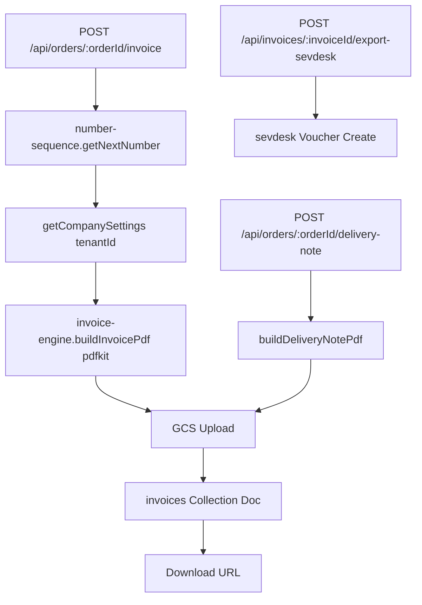

# Invoice Generation

## Was es macht

Erzeugt PDF-Rechnungen und Lieferscheine direkt aus Order-Daten mit `pdfkit`, persistiert sie in GCS und schreibt Metadaten nach `invoices`. Optionaler Export nach Sevdesk via `lib/sevdesk.js`. Per-Tenant Company-Settings (Firmenname, Adresse, USt-ID, Bank, Logo) aus `company_settings` Collection.

## Wie es funktioniert

### Engine (`backend/services/invoice-engine.js`)

- `buildInvoicePdf(order, company, invoiceMeta)` — pdfkit-Composition, Logo, Position-Tabelle, USt-Ausweis, IBAN/BIC, Footer.
- `buildDeliveryNotePdf(order, company)` — Lieferschein ohne Preise.
- `getCompanySettings(tenantId)` — lädt aus `company_settings` Collection (deutsches Schema → mappt zu English-Keys für PDF).
- GCS-Bucket: `GCS_BUCKET || 'prodsandjobs'`.

### Number-Sequence (`backend/services/number-sequence.js`)

Sequenzielle Generierung von Rechnungs- und Lieferschein-Nummern (Format z. B. `R0226-23445406`). Per-Tenant Atomic-Counter via Firestore-Transaction.

### Sevdesk-Integration (`backend/lib/sevdesk.js`)

- API-Auth via `SEVDESK_API_KEY` (Secret).
- Voucher-Create für Rechnungs-Export.
- Cron `invoice-sync` reconciliert offene Sevdesk-Posten.

### Bulk-Generierung

`POST /api/invoices/bulk-generate` triggert Generation für N Orders sequenziell. Jeder Fail wird in `errors[]` gesammelt, der Job läuft weiter.

## Code-Pfade

**Backend:**
- `backend/services/invoice-engine.js` — PDF-Engine + Storage
- `backend/services/number-sequence.js` — Per-Tenant Atomic Number-Counter
- `backend/lib/sevdesk.js` — Sevdesk-API-Wrapper
- `backend/routes/invoices.js` — REST-API
- `backend/routes/orders.js`:
  - `POST /api/orders/:orderId/invoice`
  - `POST /api/orders/:orderId/delivery-note`
  - `POST /api/invoices/:invoiceId/export-sevdesk`
- Cron-Jobs in `backend/index.js`: `invoice-sync` (Sevdesk-Reconcile)

**Frontend:**
- `components/orders/InvoicesView.tsx` — Liste + Bulk-Generate + Sevdesk-Import
- `components/OrderDetail.tsx` — Per-Order Invoice/Delivery-Note-Trigger

> Hinweis: `backend/lib/pdf` existiert nicht — pdfkit wird direkt in `invoice-engine.js` genutzt.

### Datenmodell

| Collection | Zweck |
|---|---|
| `invoices` | Rechnungs-Metadaten (`number`, `orderId`, `pdfUrl`, `total`, `tax`, `status`, `sevdeskVoucherId?`) |
| `company_settings` | Per-Tenant Firmen-Stammdaten (Name, Adresse, USt-ID, Bank, Logo) |
| `number_sequences` | Atomic-Counter pro Sequenz-Typ (invoice, delivery_note) |

## Feature-Flags

| Flag | Default | Wirkung |
|---|---|---|
| `GCS_BUCKET` | `prodsandjobs` | Bucket für PDF-Uploads |
| `SEVDESK_API_KEY` | – (Secret) | Sevdesk-Export-Auth |
| `BACKGROUND_JOB_TENANTS` | `''` | Multi-Tenant Cron-Fan-Out für `invoice-sync` |

## API-Endpoints

Verweis auf `docs/kb/09-api/` (TBD).

- `GET  /api/invoices` — Liste
- `POST /api/invoices` — Manuell anlegen
- `PATCH /api/invoices/:id` — Update (auth: `orders.write`)
- `POST /api/invoices/import-sevdesk` — Sevdesk → AvyCloud Import
- `POST /api/invoices/bulk-generate` — Bulk-Generation für N Orders
- `GET  /api/invoices/:invoiceId/download` — PDF-Download
- `POST /api/orders/:orderId/invoice` — Per-Order Generierung
- `POST /api/orders/:orderId/delivery-note` — Lieferschein
- `POST /api/invoices/:invoiceId/export-sevdesk` — Sevdesk-Export

## UI-Pages

Verweis auf `docs/kb/05-pages/` (TBD).

- `/invoices` → `InvoicesView`
- OrderDetail → "Rechnung erzeugen" / "Lieferschein erzeugen"

## Spec

TBD — keine Stand-alone-Spec.

## Bekannte Issues

TBD — laufende Bugs siehe `TASKS.md`.
