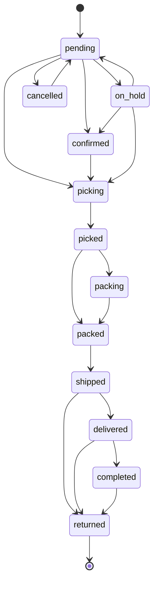

# Order Lifecycle

## Was es macht

Bildet das gesamte OMS in einer State-Machine ab — von Marketplace-Order-Intake (eBay/Kaufland) über Pick/Pack/Ship bis Delivery/Returns. Erzwingt alle Status-Übergänge ausschließlich über `transitionOrder()` (CLAUDE.md Punkt 11), loggt jeden Übergang in `order_events`, und triggert Side-Effects via `sync-event-bus`.

## Wie es funktioniert



Allowed Transitions (`backend/services/order-state-machine.js`):

| From | Allowed To |
|---|---|
| pending | confirmed, picking, cancelled, on_hold |
| confirmed | picking, cancelled, on_hold |
| picking | picked, cancelled, on_hold |
| picked | packing, packed, cancelled, on_hold |
| packing | packed, cancelled, on_hold |
| packed | shipped, cancelled, on_hold |
| shipped | delivered, returned |
| delivered | completed, returned |
| completed | returned |
| cancelled | pending (Re-open) |
| on_hold | pending, confirmed, picking, cancelled |
| returned | (terminal) |

### Order-Intake

- **eBay** (`backend/services/order-intake-ebay.js`): `GetOrders` Trading-API-Call (default 7 Tage), Mapping zu V2-Schema, `reserveStock()`, `syncStockWithRetry()`, `emitSyncEvent('order:created', …)`.
- **Kaufland** (`backend/services/order-intake-kaufland.js`): Kaufland Seller-API. **Kein direktes `omsStatus` schreiben** (CLAUDE.md Punkt 11) — Status-Übergang ausschließlich via `transitionOrder()`.
- **Order-Source-Router** (`backend/services/order-source-router.js`): Zentrales SKU-Lookup (`findProductsBySkuChunk`) + Tenant-Resolution.
- **Order-Sync** (`backend/services/order-sync.js`): Periodischer Sync-Worker.

### Status-Transition (`transitionOrder`)

```js
await transitionOrder({
  tenantId, orderId, toStatus,
  actor: { uid, email },
  note?, force?, timestamps?,
});
```

Implementiert als Firestore-Transaction:
1. Read `orders/{orderId}`.
2. Validate `isTransitionAllowed(fromStatus, toStatus)` (außer `force=true`).
3. Update `omsStatus`, `omsStatusUpdatedAt`, optional `timestamps.{key}` (z. B. `picked_at`, `shipped_at`).
4. Log Event in `order_events` (Append-only Audit).
5. Emit `order:status_changed` (z. B. triggert `_onOrderShipped` für Pfad-B-Decrement, siehe `stock-management.md`).

### Side-Effects per Übergang

- `pending → picking`: optional Stock-Reservation-Confirm.
- `packed → shipped`: Trigger `_onOrderShipped` → Pfad-B-Decrement (nur wenn nicht via Pick-with-Order schon dekrementiert), `marketplace-tracking.pushTrackingToMarketplace()` (eBay CompleteSale + Kaufland Carrier-Code).
- `* → returned`: Trigger Returns-Workflow.
- `* → cancelled`: optional `releaseReservation()`.

### Bulk Operations

- `POST /api/orders/bulk-transition` — Status-Übergang für N Orders.
- `POST /api/orders/bulk-ship` — Sammel-Versand-Trigger.

### Background-Jobs (Multi-Tenant)

`backend/index.js` startet 6 Safety-Net-Cron-Jobs (returns-sync, sendcloud-sync, tracking-catchup, delivery-poll, invoice-sync, refund-push). Multi-Tenant-Fan-Out via `BACKGROUND_JOB_TENANTS` (komma-separiert) und `lib/background-job-tenants.js`.

## Code-Pfade

**Backend:**
- `backend/services/order-state-machine.js` — `transitionOrder`, `isTransitionAllowed`, `getNextStatuses`, `getStatusInfo`, `_onOrderShipped`
- `backend/services/order-intake-ebay.js` — `fetchEbayOrders`, Mapping, Reservation
- `backend/services/order-intake-kaufland.js` — Kaufland Seller-API-Intake
- `backend/services/order-source-router.js` — SKU-Lookup + Tenant-Resolution
- `backend/services/order-sync.js` — Periodischer Sync
- `backend/services/sync-event-bus.js` — `emitSyncEvent`, Listener-Registry
- `backend/services/stock-reservation.js` — Soft-Locks
- `backend/services/marketplace-tracking.js` — Tracking push back to marketplace (siehe `shipping-engine.md`)
- `backend/lib/order-stock-claim.js` — `claimOrderStockDecrementInTx` (Single-Writer-Marker)
- `backend/lib/background-job-tenants.js` — Multi-Tenant-Fan-Out für Cron
- `backend/routes/orders.js` — REST-Endpoints

**Frontend:**
- `components/OrdersView.tsx` — Liste aller Orders mit Filter
- `components/OrderDetail.tsx` — Detail + Status-Übergang-UI
- `components/orders/ShippingDecisionDialog.tsx` — Versand-Methoden-Auswahl
- `components/orders/ShippingView.tsx` — Versand-Tab
- `components/MobileOperationsView.tsx` — Mobile Pick/Pack
- `components/OperationsView.tsx` — Desktop Pick/Pack
- `lib/oms-labels.ts` — Frontend-Labels für Status-Anzeige

### Datenmodell

| Collection | Zweck |
|---|---|
| `orders` | Order-Hauptdokument (`omsStatus`, `timestamps`, `lineItems`, `shippingAddress`, …) |
| `order_events` | Append-only Audit-Trail aller Übergänge |
| `stock_reservations` | Soft-Locks zwischen Order und Pick |
| `shipments` | SendCloud-Parcel-Tracking |
| `returns` | Retouren (siehe `returns-workflow.md`) |
| `invoices` | Rechnungen (siehe `invoice-generation.md`) |

## Feature-Flags

| Flag | Default | Wirkung |
|---|---|---|
| `BACKGROUND_JOB_TENANTS` | `''` | Komma-separierte Tenants für Multi-Tenant-Cron-Fan-Out |
| `STOCK_RESERVATION_EXPIRY_HOURS` | `72` | Reservation-Expiry (siehe `stock-management.md`) |
| `STOCK_CHANGED_EMIT_ENABLED` | `true` | `stock:changed` Event nach Decrement |

## API-Endpoints

Verweis auf `docs/kb/09-api/` (TBD). Auswahl aus `backend/routes/orders.js`:

- `GET   /api/orders` — Liste mit Filter
- `GET   /api/orders/:orderId/detail` — Detail
- `GET   /api/orders/:orderId/timeline` — Status-History (`order_events`)
- `POST  /api/orders/:orderId/transition` — Status-Übergang
- `POST  /api/orders/:orderId/complete` — Pick komplett (auth: `orders.pick`)
- `POST  /api/orders/:orderId/pack` — Pack (auth: `orders.pack`)
- `POST  /api/orders/:orderId/ship` — Versand (auth: `orders.write`)
- `POST  /api/orders/:orderId/refresh-shipment` — Tracking-Refresh
- `POST  /api/orders/:orderId/cancel-label` — Label-Storno
- `POST  /api/orders/:orderId/tracking` — Manueller Tracking-Eintrag
- `POST  /api/orders/:orderId/invoice` — Rechnungs-Generierung
- `POST  /api/orders/:orderId/delivery-note` — Lieferschein-Generierung
- `POST  /api/orders/sync` — Marketplace-Sync-Trigger
- `POST  /api/orders/sync/marketplace` — Per-Marketplace
- `POST  /api/orders/bulk-ship` / `bulk-transition` — Bulk
- `GET   /api/orders/statuses` — Verfügbare Statuses + Metadata

Auth: `orders.read|write|pick|pack`.

## UI-Pages

Verweis auf `docs/kb/05-pages/` (TBD).

- `/orders` → `OrdersView`
- `/orders/:id` → `OrderDetail`
- `/operations` → `OperationsView` (Pick/Pack-Workflow)
- Mobile Bottom-Tab "Lager" → Mobile-Pick/Pack-Flows

## Spec

TBD — keine Stand-alone-Spec. Architektur-Verweis: `docs/kb/02-architecture/eventing.md` (TBD). State-Machine ist in `services/order-state-machine.js` selbst-dokumentiert.

## Bekannte Issues

- **CLAUDE.md Punkt 11**: Intake-Services dürfen `order.omsStatus` NIE direkt via `orderRef.update()` schreiben. Aktuelles Risiko: `services/order-intake-kaufland.js` hatte historisch direkte Updates (Incident-Reference). Aktuelle Lage: TBD — mit `transitionOrder()` migriert, falls Regressionen siehe `TASKS.md`.
- Weitere laufende Bugs siehe `TASKS.md`.
