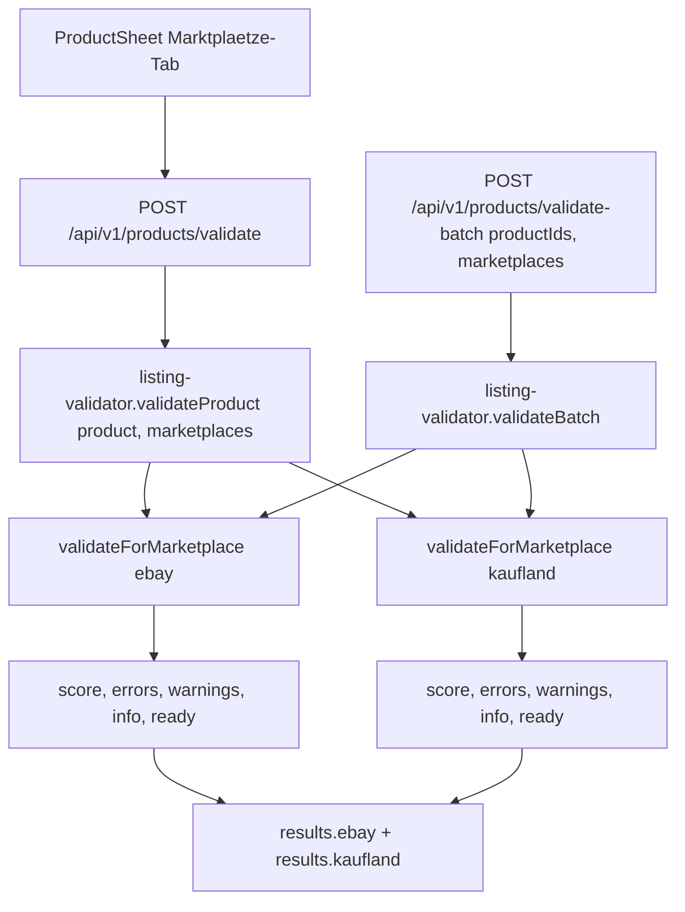

# Pre-Listing Validation

## Was es macht

Validiert ein Produkt-Datenblatt vor dem Marketplace-Publish gegen marktplatz-spezifische Anforderungen (eBay DE + Kaufland). Liefert pro Marketplace einen Score (0–100), Errors (blocking), Warnings (non-blocking) und Info-Items (Best Practice) mit Korrektur-Vorschlägen. Keine Schreib-Side-Effects — Validation ist on-demand.

## Wie es funktioniert



### Validierungs-Engine (`backend/services/listing-validator.js`)

eBay-Profile prüft:
- Title (≤ 80 Zeichen, nicht leer)
- Mind. 1 Bild
- `categoryId` ist gültiger eBay-Leaf (`isKnownEbayCategoryId`)
- Banned eBay-Breadcrumb (`isBannedEbayBreadcrumb`)
- Required Aspects (`getRequiredAspects` + `getCategoryAspectCatalog`)
- Description (mind. minimaler Inhalt)
- EAN/Identifiers (Format)
- Pricing (vorhanden)
- GPSR-Compliance (Manufacturer + Address)

Kaufland-Profile prüft:
- Title, Bilder, EAN, Category, Mandatory Attributes

Output-Schema pro Marketplace:

```js
{
  marketplace: 'ebay',
  score: 85,
  ready: false,
  errors:   [{ code, severity:'error',   message, fields, suggestion }],
  warnings: [{ code, severity:'warning', message, fields, suggestion }],
  info:     [{ code, severity:'info',    message, fields, suggestion }],
  counts: { errors, warnings, info }
}
```

### Score-Berechnung

Aggregation aus `evaluateEbayReady` und `buildEbayReadyIssuesDetailed` (siehe `backend/lib/datasheet-quality.js`, `backend/lib/ebay-ready-issues.js`). Score-Schwellen:

| Score | Badge | Status |
|---|---|---|
| 90–100 | Grün — "Bereit" | `ready=true` |
| 70–89 | Gelb — "Eingeschränkt" | `ready=false` |
| 0–69 | Rot — "Nicht bereit" | `ready=false` |

### Read-only Dependencies

Engine nutzt bestehende Module ohne Modifikation:
- `lib/ebay-taxonomy.js` (`getRequiredAspects`, `isKnownEbayCategoryId`, `getCategoryAspectCatalog`, `findEbayCategory`)
- `lib/ebay-category-governance.js` (`isBannedEbayBreadcrumb`)
- `lib/datasheet-quality.js` (`evaluateEbayReady`)
- `lib/ebay-ready-issues.js` (`buildEbayReadyIssuesDetailed`, `countSeverities`)
- `lib/product-canonical.js` (`validateCanonical`)

## Code-Pfade

**Backend:**
- `backend/services/listing-validator.js` — Engine, Marketplace-Profiles, Score-Berechnung
- `backend/routes/products.js`:
  - `POST /api/v1/products/validate` (auth: `products.read`)
  - `POST /api/v1/products/validate-batch` (auth: `products.read`)
- `backend/__tests__/services/listing-validator.test.js` — Unit-Tests
- `backend/services/listing-validator.test.js` — (zusätzliche Test-Datei am Service-Ort)

**Frontend:**
- `components/ValidationPanel.tsx` — Validation-UI im Marktplaetze-Tab
- `components/ProductSheet.tsx` — bindet `ValidationPanel` ein
- `hooks/useValidation.ts` — `runValidation(product, marketplaces)`
- `api/client.ts` — `validateProduct`, `validateProductBatch`

### Datenmodell

Keine neuen Collections. Validation ist on-demand und reines API-Response.

## Feature-Flags

Keine dedizierten ENV-Flags. `QUALITY_GATE_ENABLED` (default `true`) steuert Post-Save-Quality-Job, ist aber separat von Pre-Listing-Validation.

## API-Endpoints

Verweis auf `docs/kb/09-api/` (TBD). `backend/routes/products.js`:

- `POST /api/v1/products/validate` — `{ product, marketplaces? = ['ebay','kaufland'] }`
- `POST /api/v1/products/validate-batch` — `{ productIds[], marketplaces? }` (max 100 IDs)

## UI-Pages

Verweis auf `docs/kb/05-pages/` (TBD).

- ProductSheet → "Marktplätze"-Tab → `ValidationPanel` (Score-Badges + Issue-Listen mit Severity-Icons + Fix-Suggestions)

## Spec

- [archivierte VAL-001-Spec](../../archive/features/completed/VAL-001-pre-listing-validation-spec.md)

## Bekannte Issues

TBD — laufende Bugs siehe `TASKS.md`.
