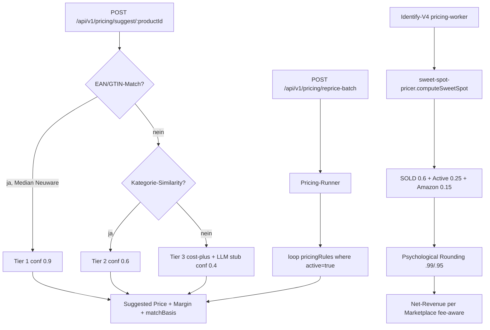

# Pricing Engine

## Was es macht

Berechnet pro Produkt einen optimalen Verkaufspreis aus Wettbewerber-Daten (eBay Browse, Kaufland, Amazon, Idealo) plus optionalen Konfigurations-Regeln (Min-Marge, Min-/Max-Preis, Strategie). Drei-Tier-Algorithmus, plus reine `sweet-spot-pricer.js`-Library für die V4-Identify-Pipeline (fee-aware, trend-gewichtet).

## Wie es funktioniert



### 3-Tier-Algorithmus (`backend/services/pricing-engine.js`)

- **Tier 1 — EAN/GTIN-Match**: Median über `details.pricing.competitorPrices` mit Neuware-Filter; `medianBased = median * 0.97`, geclamp gegen `buyPrice * 1.10`. Confidence 0.9.
- **Tier 2 — Kategorie-Similarity**: Median ähnlicher Produkte im eigenen Bestand (gleiche `categoryId`). Confidence 0.6.
- **Tier 3 — Cost-Plus**: `buyPrice * targetMargin` Fallback, optional LLM-Stub. Confidence 0.4.

### Sweet-Spot-Pricer (`backend/lib/sweet-spot-pricer.js`)

Pure Function (kein I/O, kein Gemini). Inputs: SOLD-Listings, Active-Listings, Amazon-Preis, Kaufland-Preis. Output: einzelner "sweet-spot"-Preis mit:

- Source-Weights: `sold=0.6`, `active=0.25`, `amazon=0.15`
- Marketplace-Fees: `EBAY_DE=12.5%`, `KAUFLAND_DE=16.66%` (14% Provision + 19% USt), `AMAZON_DE=15%`
- Psychological Rounding: `<10€` → `.99`, `<50€` → `.99`, `<100€` → `.95`, `≥100€` → nearest 5 + `.99`
- Sanity-Bounds: `MIN_VIABLE_PRICE=0.5€`, `MAX_VIABLE_PRICE=100000€`
- Net-Revenue-Projection pro Marktplatz (deterministisch, auditable)

Wird von `lib/identify-workers/pricing-worker.js` (V4) genutzt.

### Price-Enrichment (`backend/lib/price-enrichment.js`)

Multi-Source-Lookup:
1. SerpAPI via `ensurePriceCoverage`
2. eBay Browse API via `ebay-browse-title-insights` (`fetchBrowsePriceSamples`)
3. BrightData-backed Web-Search + HTML-Scraping (`fetchWithUnlocker`)

Pflicht-Marketplaces: `ebay.de, kaufland.de, hood.de, amazon.de, idealo.de, zalando.de`. Used-Hint-Regex filtert Refurbed/B-Ware automatisch raus.

### Pricing-Rules (`pricingRules` Collection)

Schema (Firestore Doc-ID = `productId`):

```
{
  productId, ruleType: 'competitor_median'|'category_match'|'manual'|'cost_plus',
  params: { minMargin, maxPrice, minPrice, targetMargin, competitorFilter },
  active, lastApplied, updatedAt
}
```

Pricing-Runner (`services/pricing-runner.js`) ist disabled-by-default; Trigger erfolgt manuell via `POST /api/v1/pricing/reprice-batch`.

## Code-Pfade

**Backend:**
- `backend/services/pricing-engine.js` — 3-Tier-Algorithmus + Rules-CRUD
- `backend/services/pricing-runner.js` — Scheduled Runner (default disabled)
- `backend/services/competitor-refresh-runner.js` — 72 h-Background-Fetcher (default disabled)
- `backend/lib/sweet-spot-pricer.js` — Pure Library für V4 + Auto-Fix
- `backend/lib/price-enrichment.js` — Multi-Source-Lookup
- `backend/lib/competitor-prices.js` — eBay Browse + Kaufland Lookup mit 2 h-Cache
- `backend/lib/ebay-browse-title-insights.js` — `fetchBrowsePriceSamples`
- `backend/lib/identify-workers/pricing-worker.js` — V4-Worker
- `backend/routes/products.js` (L2334+) — REST-Endpoints

**Frontend:**
- `components/PricingDashboard.tsx` — Hauptseite (Rules + Suggestions + Batch-Trigger)
- `components/pricing/PricingRuleList.tsx`
- `components/pricing/PricingRuleForm.tsx`
- `components/pricing/PricingSuggestions.tsx`
- `components/pricing/ProductPricingDetail.tsx`
- `components/CompetitorPrices.tsx`, `components/CompetitorPriceChart.tsx`

## Feature-Flags

| Flag | Default | Wirkung |
|---|---|---|
| `IDENTIFY_V4_PRICING_SOLD` | `true` | V4-pricing-worker zieht eBay SOLD-Listings |
| `PRICE_REFRESH_TIMEOUT_MS` | `20000` | Total-Timeout für Price-Refresh-Run |

`pricing-runner.js` und `competitor-refresh-runner.js` werden durch separate Trigger aktiviert (kein einzelnes ENV-Flag dokumentiert — siehe Code).

## API-Endpoints

Verweis auf `docs/kb/09-api/` (TBD). Aktuell in `backend/routes/products.js`:

- `POST /api/v1/pricing/suggest/:productId` — Suggestion mit `tier`, `confidence`, `matchBasis`
- `POST /api/v1/pricing/rules` — Rule create/update
- `GET  /api/v1/pricing/rules` — Liste aller Rules
- `POST /api/v1/pricing/reprice-batch` — Batch-Run
- `DELETE /api/v1/pricing/rules/:ruleId`
- `PATCH /api/v1/pricing/rules/:ruleId/toggle`
- `GET /api/competitor-prices?ean=` — Live-Lookup
- `GET /api/competitor-history?productId=` — 30-Tage-Trend

Auth: `products.write` (write), `products.read` (read), `admin.jobs.run` (batch).

## UI-Pages

Verweis auf `docs/kb/05-pages/` (TBD).

- `/pricing` → `PricingDashboard` (Tabs: Regeln, Vorschläge)
- ProductSheet → "Preise"-Tab via `ProductPricingDetail`

## Spec

- [docs/features/PRICE-001-pricing-engine-ui/spec.md](../../features/PRICE-001-pricing-engine-ui/spec.md) — UI-Spec (Layer 1: Backend + Modal, Layer 2: Inline, Layer 3: CSV)

## Bekannte Issues

TBD — laufende Bugs siehe `TASKS.md`.
