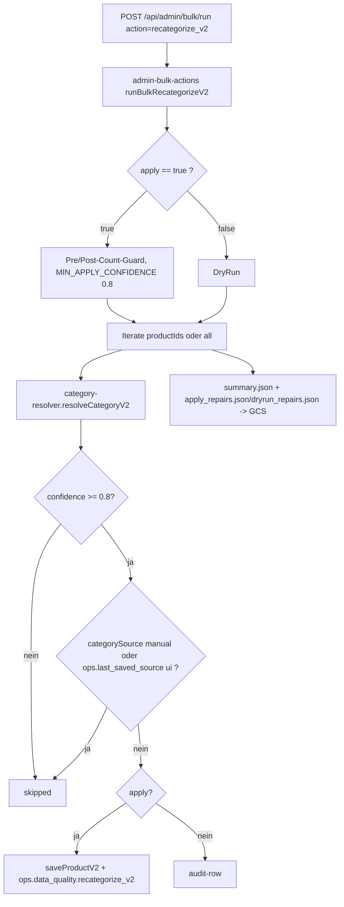

# Recategorize V2 (Bulk)

## Was es macht

Massen-Korrektur der eBay-Kategorie für Bestandsprodukte mittels `services/category-resolver.js` (V2-Resolver: Catalog GTIN → Taxonomy Suggestions → Local → Gemini). Läuft als Admin-Bulk-Job mit DryRun-First-Pflicht und mehreren Safety-Checks. Schreibt Audit-Reports nach GCS und protokolliert in `admin_job_runs`.

## Wie es funktioniert



### Safety-Mechanismen (`backend/services/admin-bulk-actions.js#runBulkRecategorizeV2`)

| Mechanismus | Verhalten |
|---|---|
| `apply: false` Default | DryRun ohne Schreiben — Pflicht-First |
| `MIN_APPLY_CONFIDENCE = 0.8` | Auch bei `minConfidence`-Override mind. 0 |
| Pre/Post-Count-Guard | Toleranz 10 — Abbruch wenn Diff zu groß |
| Skip `categorySource === 'manual'` | Manuelle Zuweisungen werden NIE überschrieben |
| Skip `ops.last_saved_source === 'ui'` | UI-Saves werden geschützt (außer `includeUi: true`) |
| Marker `ops.data_quality.recategorize_v2` | `{ at_iso, from, to }` für jede Änderung |

### Auto-Correct-Path

Bei aktivem `CATEGORY_RESOLVER_V2=true` (default) triggert jeder UI-Save ein fire-and-forget Auto-Correct via `services/category-resolver.js` für Produkte ohne `categorySource === 'manual'`. Confidence-Threshold im UI-Save: 0.85 (siehe `CLAUDE.md`).

### Audit-Reports

Nach jedem Run werden folgende Dateien in den GCS-Bucket (`STORAGE_BUCKET || 'prodsandjobs'`) geladen:
- `summary.json` — Gesamtstatistik (`processed`, `skipped`, `applied`, `errors`, Ausführungs-Metadaten)
- `dryrun_repairs.json` (DryRun) oder `apply_repairs.json` (Apply) — Liste aller geplanten/durchgeführten Änderungen pro Produkt

In Firestore wird der Job in `admin_job_runs` protokolliert.

### CLI-Script

`backend/scripts/recategorize-disallowed-ebay-roots.js` — Schwester-Script (nicht identisch). Spezifisch für **disallowed eBay-Roots** (strikte Regel: bestimmte Roots dürfen nicht in AvyCloud erscheinen). Nutzt `findEbayCategory` und `saveProduct(..., { allowCategoryChange: true })`. Default-Tenant: `avycloud` (override via `TENANT_ID`).

```bash
node backend/scripts/recategorize-disallowed-ebay-roots.js --dry-run
node backend/scripts/recategorize-disallowed-ebay-roots.js --apply --expected-count 774
```

> Hinweis: Es gibt **kein** Script `backend/scripts/recategorize-v2.js` — die Bulk-Action `recategorize_v2` läuft ausschließlich über `services/admin-bulk-actions.js`.

## Code-Pfade

**Backend:**
- `backend/services/admin-bulk-actions.js` — `runBulkRecategorizeV2` (Bulk-Action-Switcher)
- `backend/services/admin-bulk-runner.js` — Job-Runner (p-queue)
- `backend/services/category-resolver.js` — V2-Resolver (eBay Catalog GTIN → Taxonomy Suggestions → Local Lookup → Gemini)
- `backend/lib/ebay-taxonomy.js` — `findEbayCategory`, `getRequiredAspects`
- `backend/lib/ebay-taxonomy-remote.js` — Remote-Taxonomy-Suggestions
- `backend/lib/ebay-catalog.js` — eBay Catalog API (GTIN-Lookup)
- `backend/lib/ebay-category-governance.js` — `isBannedEbayBreadcrumb`
- `backend/scripts/recategorize-disallowed-ebay-roots.js` — Standalone-Script
- `backend/__tests__/services/recategorize-v2.test.js` — Unit-Tests
- `backend/lib/admin-bulk-jobs.js` — Job-Storage
- `backend/routes/products.js`:
  - `POST /api/products/bulk/run` — Trigger
  - `GET /api/products/bulk/jobs/:id` — Job-Status
- `backend/routes/admin.js` — Admin-Bulk-Run-Routen (analog)

**Frontend:**
- `components/admin/AdminBulkActions.tsx` — Trigger-UI für Admin-Bulk-Aktionen (DryRun-Toggle, Limit/Offset, Filter)

## Feature-Flags

| Flag | Default | Wirkung |
|---|---|---|
| `CATEGORY_RESOLVER_V2` | `true` | Multi-Stage-Resolver aktiv |
| `CATEGORY_RESOLVER_DYNAMIC_CONFIDENCE` | `true` | Dynamische Confidence statt hard-coded |
| `STORAGE_BUCKET` | `prodsandjobs` | Bucket für Audit-Reports |
| `TENANT_ID` | `avycloud` | Default-Tenant für CLI-Scripts |

Auto-Correct nutzt: `MIN_APPLY_CONFIDENCE=0.8` (hardcoded, Bulk-Apply), `0.85` für UI-Save-Trigger.

## API-Endpoints

Verweis auf `docs/kb/09-api/` (TBD).

- `POST /api/admin/bulk/run` (auth: `admin.bulk.run`) — Body z. B. `{ action: 'recategorize_v2', apply: false, limit?, offset?, productIds?, includeUi?, debug? }`
- `POST /api/products/bulk/run` (auth: `products.write`) — Alternative-Trigger
- `GET  /api/products/bulk/jobs/:id` (auth: `products.read`) — Job-Status

## UI-Pages

Verweis auf `docs/kb/05-pages/` (TBD).

- AdminPanel → `AdminBulkActions` Tab → "Recategorize V2"-Trigger

## Spec

TBD — keine Stand-alone-Spec.

## Bekannte Issues

TBD — laufende Bugs siehe `TASKS.md`.
