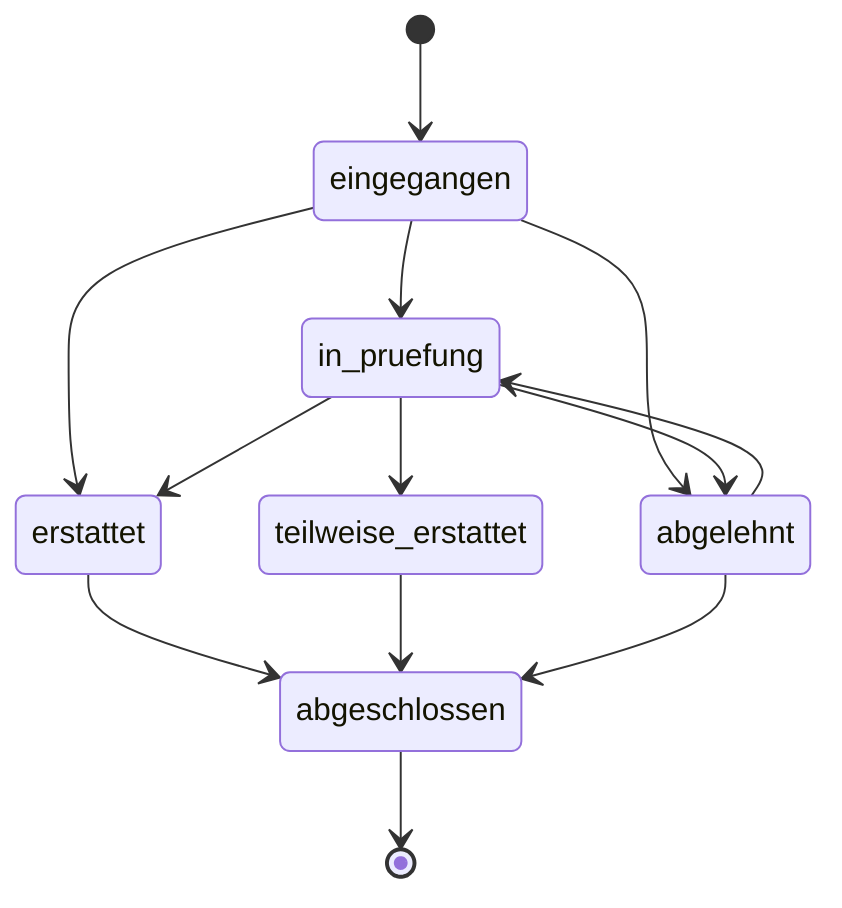

# Returns Workflow

## Was es macht

Verwaltet Marketplace-Retouren (eBay + Kaufland): Intake aus Webhooks/Polls, eigene State-Machine mit 6 Status, Reason-Kategorisierung mit Default-Refund-Mode, sowie Refund-Push zurück an den Marketplace. Workflow ist getrennt von der Order-State-Machine, weil Retouren eigene Transitions haben.

## Wie es funktioniert

### Return-Statuses (`backend/services/returns-engine.js`)

| Status | Bedeutung |
|---|---|
| `eingegangen` | Retoure empfangen/angelegt |
| `in_pruefung` | Inspektion |
| `erstattet` | Voll erstattet |
| `teilweise_erstattet` | Teilweise erstattet |
| `abgelehnt` | Abgelehnt |
| `abgeschlossen` | Final (terminal) |

### Reason-Kategorien

Validiert mapped reason gegen `VALID_REASONS`-Set; unbekannte → fallback `'sonstiges'`.

| Reason | Label | refundDefault |
|---|---|---|
| defekt | Defekt / Beschädigt | full |
| falsche_lieferung | Falsche Lieferung | full |
| nicht_wie_beschrieben | Nicht wie beschrieben | full |
| zu_spaet | Zu spät geliefert | full |
| meinungsaenderung | Meinungsänderung | full |
| doppelbestellung | Doppelbestellung | full |
| sonstiges | Sonstiges | partial |

### Workflow

1. **Intake**: `POST /api/returns/sync` pollt eBay+Kaufland Returns API. Webhooks ergänzen den Pull.
2. **Process**: `POST /api/returns/:id/process` setzt `in_pruefung`.
3. **Refund**: `POST /api/returns/:id/refund` schreibt Refund (Mode `full|partial`) und pusht ggf. zurück an Marketplace.
4. **Close**: `POST /api/returns/:id/close` setzt `abgeschlossen`.
5. Jeder Status-Wechsel wird in `return_events` Append-only protokolliert.

### Cron-Sync

`returns-sync` Cron-Job (`backend/index.js`) pollt periodisch alle Tenants. Multi-Tenant-Fan-Out via `BACKGROUND_JOB_TENANTS`. `refund-push` Cron pusht offene Refunds zurück.

## Code-Pfade

**Backend:**
- `backend/services/returns-engine.js` — State-Machine, Reason-Validation, Refund-Engine
- `backend/routes/returns.js` — REST-API (10 Endpoints)
- `backend/lib/html-entities.js` — `sanitizeText`, `validateEmail`
- `backend/services/order-state-machine.js` — Mit `* → returned` Übergang verzahnt

**Frontend:**
- `components/orders/ReturnsView.tsx` — Liste + Detail-Drawer + Quick-Actions
- `components/OrdersView.tsx` — Verlinkt zu Retouren

### Datenmodell

| Collection | Zweck |
|---|---|
| `returns` | Retouren-Hauptdoc (`status`, `reason`, `refundAmount`, `mode`, `marketplaceReturnId`) |
| `return_events` | Append-only Events |
| `orders.returnIds[]` | Referenz auf zugehörige Retouren |

## Feature-Flags

| Flag | Default | Wirkung |
|---|---|---|
| `BACKGROUND_JOB_TENANTS` | `''` | Multi-Tenant Cron-Fan-Out |

## API-Endpoints

Verweis auf `docs/kb/09-api/` (TBD). `backend/routes/returns.js`:

- `GET  /api/returns` — Liste mit Filter
- `GET  /api/returns/reasons` — Reason-Stamm
- `POST /api/returns` — Manuell anlegen
- `POST /api/returns/sync` — Marketplace-Pull
- `POST /api/returns/bulk-action` — Bulk-Status-Update
- `PATCH /api/returns/:id` — Update (z. B. Status)
- `POST /api/returns/:id/process` — In Prüfung setzen
- `POST /api/returns/:id/refund` — Refund + Push to Marketplace
- `POST /api/returns/:id/close` — Schließen
- `GET  /api/returns/:id/events` — Event-History

## UI-Pages

Verweis auf `docs/kb/05-pages/` (TBD).

- `/returns` → `ReturnsView`

## Spec

TBD — keine Stand-alone-Spec.

## Bekannte Issues

TBD — laufende Bugs siehe `TASKS.md`.
