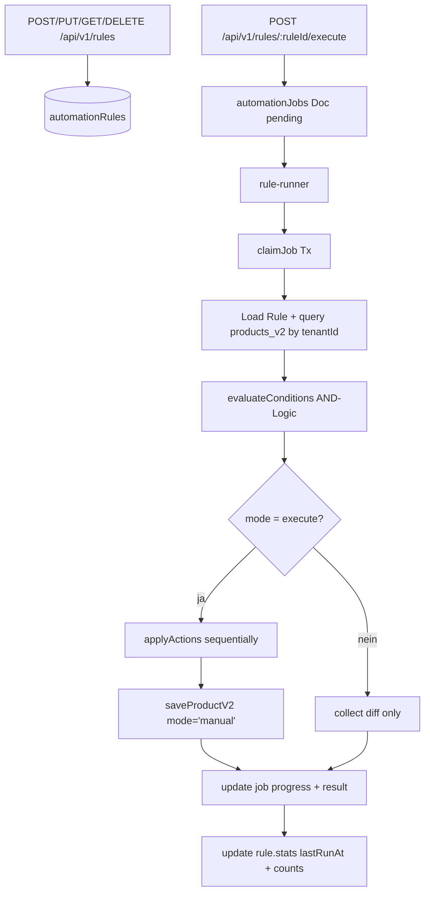

# Rule Engine

## Was es macht

Visueller "Wenn–Dann"-Automation-Builder, der beliebige Felder in `products_v2` über Bedingungen + Aktionen transformiert. Sellers definieren Rules (z. B. "Preis runden auf .99", "Niedrigbestand markieren"), führen sie als Dry-Run oder Execute aus und sehen Ergebnisse pro Produkt mit Diff-Preview.

## Wie es funktioniert

### Conditions (AND-Logic)

10 Operatoren in `evaluateCondition` (`backend/services/rule-engine.js`):

`equals`, `not_equals`, `contains`, `not_contains`, `starts_with`, `ends_with`, `greater_than`, `less_than`, `is_empty`, `is_not_empty`.

Felder operieren auf beliebigen nested Pfaden (`getNestedField`/`setNestedField`), z. B. `details.pricing.sellPrice`, `inventory.quantity`, `identification.brand`.

### Actions (sequenziell)

5 Action-Types: `set_field`, `adjust_price` (params.mode `percent`/`absolute`), `prepend_text`, `append_text`, `replace_text` (params.search/replace).

### Job-Lifecycle (`backend/services/rule-runner.js`)

- p-queue, Concurrency `RULE_JOB_CONCURRENCY` (default 1).
- Chunked Processing (200 Produkte pro Batch) für große Kataloge.
- `mode='dry_run'` sammelt Diff ohne Schreiben; `mode='execute'` schreibt via `saveProductV2()`.
- Rule-Stats werden nach jedem Run aktualisiert: `lastRunAt`, `lastRunProducts`, `lastRunApplied`, `totalRuns++`.
- Skip-Detection: wenn Action denselben Wert setzen würde, wird das Produkt als `skipped` gezählt, nicht `applied`.

### Audit-Integration

Rule-Änderungen (create/update/delete/execute) loggen via `logAudit()` in `audit_log` (siehe `audit-log-feature.md`).

### Rulebook (legacy/parallel)

`backend/lib/llm-rulebook.js` + `backend/lib/rulebook-config.js` + `backend/lib/rulebook-admin.js` + `backend/services/rulebook-runner.js` + `backend/lib/rulebook-apply-jobs.js` sind die ältere LLM-zentrische Rulebook-Mechanik (Title-Rules, Highlights, Attributes-Normalization). Sie ist getrennt von der neuen Visual Rule Engine, dient als Job-Runner-Pattern-Vorlage und bleibt aktiv.

## Code-Pfade

**Backend:**
- `backend/services/rule-engine.js` — `evaluateCondition`, `evaluateConditions`, `applyAction`, `executeRule`, `getMatchingProducts`
- `backend/services/rule-runner.js` — p-queue Job-Runner (Pattern aus `rulebook-runner.js`)
- `backend/routes/rules.js` — REST-API (8 Endpoints, siehe unten)
- `backend/lib/product-store.js` — `saveProductV2()` Write-Path
- `backend/lib/llm-rulebook.js` — Legacy-LLM-Rulebook
- `backend/lib/rulebook-config.js` — Admin-editierbare Rulebook-Config
- `backend/lib/rulebook-admin.js` — Admin-CRUD Helpers
- `backend/services/rulebook-runner.js` — Legacy-Rulebook-Runner (p-queue Pattern)
- `backend/lib/rulebook-apply-jobs.js` — Job-Storage für Rulebook
- `backend/__tests__/rule-engine.test.js` — Unit-Tests Operatoren + Action-Types

**Frontend:**
- `components/RuleDashboard.tsx` — Hauptseite (KPIs + RuleList)
- `components/rules/RuleList.tsx`
- `components/rules/RuleForm.tsx`
- `components/rules/ConditionRow.tsx`
- `components/rules/ActionRow.tsx`
- `components/rules/RulePreview.tsx`
- `components/rules/RuleTemplates.tsx`
- `components/admin/AdminRulebookManagement.tsx` — Admin-UI für Legacy-Rulebook

### Datenmodell

| Collection | Zweck |
|---|---|
| `automationRules` | Visual-Rule-Definitionen (`tenantId`, `conditions`, `actions`, `stats`, `channel`) |
| `automationJobs` | Job-Lifecycle (`status`, `mode`, `progress`, `result.changes[]`) |
| `audit_log` | Audit-Trail für rule.created/updated/deleted/executed |

## Feature-Flags

| Flag | Default | Wirkung |
|---|---|---|
| `RULE_JOB_CONCURRENCY` | `1` | Parallel-Jobs (siehe Spec) |
| `RULE_JOB_MAX_ATTEMPTS` | `2` | Max-Attempts vor `failed` |
| `RULE_JOB_SWEEP_MS` | `45000` | Sweeper-Intervall |

## API-Endpoints

Verweis auf `docs/kb/09-api/` (TBD). Aktuell in `backend/routes/rules.js`:

- `GET  /api/v1/rules` — Liste, Query `?active=true`
- `GET  /api/v1/rules/:ruleId` — Einzelne Rule
- `POST /api/v1/rules` — Create
- `PUT  /api/v1/rules/:ruleId` — Update
- `DELETE /api/v1/rules/:ruleId` — Delete
- `PATCH /api/v1/rules/:ruleId/toggle` — Aktiv-Toggle
- `POST /api/v1/rules/:ruleId/execute` — Job starten (`mode: 'execute'|'dry_run'`)
- `GET  /api/v1/rules/jobs/:jobId` — Job-Status + Result
- `GET  /api/v1/rules/:ruleId/preview` — Quick-Preview (max 100 Samples)

Auth: jede Route über `requireAuth` + Tenant-Isolation.

## UI-Pages

Verweis auf `docs/kb/05-pages/` (TBD).

- `/rules` → `RuleDashboard`
- Sidebar-Eintrag "Regeln"
- Templates: Preisrundung, Niedrigbestand-Marker, Mindestpreis-Guard, eBay-Titel-Prefix, Zustand-Standardisierung, Fehlende-Beschreibung-Filler

## Spec

- [docs/features/RULE-001-rule-engine/spec.md](../../features/RULE-001-rule-engine/spec.md) — Vollständige Spec inkl. Architektur, Datenmodell, API-Contracts, Templates, Edge-Cases.

## Bekannte Issues

TBD — laufende Bugs siehe `TASKS.md`.
