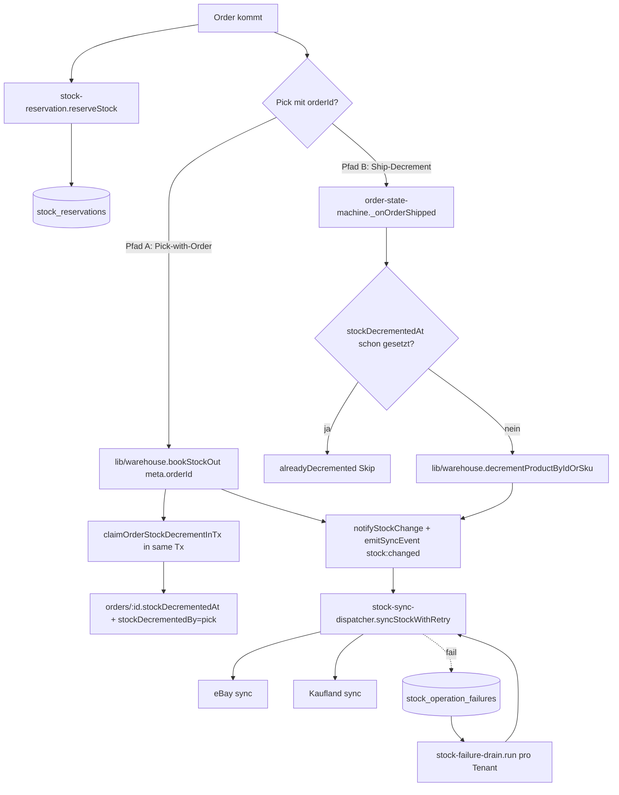

# Stock Management

## Was es macht

Verwaltet `products_v2.inventory.quantity` als einzige autoritative Wahrheit für Bestand. Erzwingt das **Stock Single Writer Invariant** (CLAUDE.md Punkt 13): pro `(sku × order)` darf der Bestand während des Order-Lifecycle GENAU EINMAL dekrementiert werden. Schützt vor Oversell durch Firestore-Locks, Stock-Reservations, Marketplace-Sync-Events, Failure-Drain und Inventory-Ledger.

## Wie es funktioniert

### Stock Single Writer Invariant

Zwei legitime Decrement-Pfade — via `order.stockDecrementedAt`-Marker MUTUALLY EXCLUSIVE:

- **Pfad A — Pick-with-Order** (`lib/warehouse.js bookStockOut` mit `meta.orderId`): authoritativer Decrement bei physischer Pick-Bewegung. MUSS in derselben Firestore-Tx den Marker `orders/{orderId}.stockDecrementedAt + stockDecrementedBy='pick' + stockDecrementedSkus=[…]` setzen via `lib/order-stock-claim.js#claimOrderStockDecrementInTx()`.
- **Pfad B — Ship-Decrement** (`services/order-state-machine.js _onOrderShipped` → `lib/warehouse.js decrementProductByIdOrSku`): authoritativer Decrement bei Versand, NUR wenn Pfad A nicht gelaufen ist. Geschützt durch `alreadyDecremented`-Skip.

**Verboten:**
1. `tx.update(productRef, { 'inventory.quantity': X })` außerhalb von `lib/warehouse.js`/`lib/product-store.js`. Bekannte Schuld: `routes/marketplace.js:966` (Kaufland-Reconcile, TASKS.md Gap C).
2. `bookStockOut` mit `meta.orderId` ohne `claimOrderStockDecrementInTx()`-Aufruf.
3. Stock-Mutation ohne `notifyStockChange()` (sonst kein `inventory_ledger`-Eintrag, Telemetrie blind).

Repair-Path: `backend/scripts/repair-double-decrement.js` (read-only audit, opt-in `--apply`). Regression-Test: `backend/__tests__/stock-pick-then-ship-no-double-decrement.test.js`.

### Distributed Lock

`backend/lib/stock-lock.js` mit Firestore-Backend (default in Production). Lease `STOCK_LOCK_LEASE_MS` (30 s), Wait-Slice 100 ms. In-Memory-Backend nur für Tests erlaubt (`STOCK_LOCK_BACKEND=memory`). Collection `stock_locks`.

### Stock-Change-Events (`backend/lib/stock-change-events.js`)

Wird an JEDER Stelle aufgerufen, die `inventory.quantity` mutiert (`saveProductV2`, `refreshProductInventory`):

1. `emitSyncEvent('stock:changed', …)` → `services/sync-event-bus.js` → triggert Marketplace-Sync-Listener (Flag `STOCK_CHANGED_EMIT_ENABLED`, default on).
2. Append-only Eintrag in `inventory_ledger` Collection (Flag `INVENTORY_LEDGER_ENABLED`, default on).

Beides ist fehlertolerant — Event-Bus oder Firestore-Failures throwen NICHT, damit die ursprüngliche Stock-Mutation nicht retrospektiv fehlschlägt.

### Failure-Drain (`backend/services/stock-failure-drain.js`)

Periodischer Worker pro Tenant. Liest `stock_operation_failures` (`status='pending'`) und retried jede `step:'marketplaceSync'`-Position via `syncStockWithRetry`. **Bewusst nicht retried**: `step:'decrement'` (Doppel-Decrement-Risiko bei partiellem Initial-Erfolg) → markiert als `needs_manual` für Alerting. Max-Attempts 5.

### Stock-Reservation (`backend/services/stock-reservation.js`)

Soft-Lock zwischen Order-Eingang und Pick. Idempotent (Skip wenn schon `reserved` für `orderId`). Default-Expiry 72 h (`STOCK_RESERVATION_EXPIRY_HOURS`). Collection `stock_reservations`.

## Code-Pfade

**Backend:**
- `backend/lib/warehouse.js` — `bookStockOut`, `bookStockIn`, `decrementProductByIdOrSku`, `refreshProductInventory`, BIN-Logik (siehe `warehouse-bins.md`)
- `backend/lib/stock-lock.js` — `withStockLock`, Firestore-Lease-Lock
- `backend/lib/stock-change-events.js` — `notifyStockChange`, Event + Ledger
- `backend/lib/order-stock-claim.js` — `claimOrderStockDecrementInTx`, Marker-Setzung
- `backend/lib/product-store.js` — `saveProductV2()` Canonical Write Path
- `backend/services/stock-reservation.js` — Soft-Locks
- `backend/services/stock-failure-drain.js` — Drain-Worker
- `backend/services/stock-sync-dispatcher.js` — `syncStockWithRetry`, Channel-Logik (eBay EndItem bei qty=0, Kaufland ONHOLD bei qty=0)
- `backend/services/stock-reconciliation.js` — Periodische Reconciliation
- `backend/services/sync-event-bus.js` — `emitSyncEvent`, Listener-Registrierung
- `backend/services/order-state-machine.js` — `_onOrderShipped` mit Pfad-B-Decrement + Skip
- `backend/scripts/repair-double-decrement.js` — Audit + opt-in Repair
- Tests:
  - `backend/__tests__/stock-pick-then-ship-no-double-decrement.test.js`
  - `backend/__tests__/oversell-invariant.test.js`
  - `backend/__tests__/stock-lock.test.js`
  - `backend/__tests__/stock-change-events.test.js`
  - `backend/__tests__/stock-failure-drain.test.js`
  - `backend/__tests__/stock-reconciliation.test.js`
  - `backend/__tests__/stock-shipped-idempotency.test.js`
  - `backend/__tests__/stock-sync-retry-failure-queue.test.js`
  - `backend/__tests__/pick-stock-out-tx-read-before-write.test.js`

**Frontend:**
- `components/InventoryView.tsx` — Bestands-Übersicht
- `components/InventoryDrilldownPanel.tsx` — Drilldown pro Produkt
- `components/AdminTable.tsx` — `inventory.quantity` Spalte

### Datenmodell

| Collection | Zweck |
|---|---|
| `products_v2.inventory.quantity` | **Authoritative Bestandsmenge** |
| `warehouseBins` | BIN-Inhalte (Lager-Position → Produkte) |
| `warehouseEvents` | Append-only Event-Log (`stock_in`, `stock_out`, `flow:'pick'` etc.) |
| `inventory_ledger` | Append-only Ledger pro `notifyStockChange`-Call |
| `stock_locks` | Firestore-Lease-Locks |
| `stock_reservations` | Soft-Locks Order → Pick |
| `stock_operation_failures` | Drain-Queue für Marketplace-Sync-Failures |
| `stock_sync_log` / `stock_sync_failures` | 24 h-Sync-Telemetry |
| `orders.{stockDecrementedAt, stockDecrementedBy, stockDecrementedSkus}` | Single-Writer-Marker |

## Feature-Flags

| Flag | Default | Wirkung |
|---|---|---|
| `STOCK_LOCK_BACKEND` | `firestore` (Prod), `memory` (Tests) | Distributed-Lock-Backend |
| `STOCK_LOCK_COLLECTION` | `stock_locks` | Firestore-Collection |
| `STOCK_LOCK_LEASE_MS` | `30000` | Lease-Dauer |
| `STOCK_LOCK_WAIT_SLICE_MS` | `100` | Polling-Intervall |
| `STOCK_CHANGED_EMIT_ENABLED` | `true` | `stock:changed` Event emittieren |
| `INVENTORY_LEDGER_ENABLED` | `true` | Ledger schreiben |
| `STOCK_RESERVATION_EXPIRY_HOURS` | `72` | Reservation-Expiry |
| `STOCK_FAILURE_DRAIN_TENANTS` | `''` | Multi-Tenant-Fan-Out für Drain (komma-separiert) |
| `BACKGROUND_JOB_TENANTS` | `''` | Multi-Tenant-Fan-Out für Cron-Jobs |
| `USE_PRODUCTS_V2` | `true` | Collection `products_v2` aktiv |

## API-Endpoints

Verweis auf `docs/kb/09-api/` (TBD). Stock-Mutationen erfolgen primär durch interne Services. UI-Trigger:

- `POST /api/warehouse/stock-in` — Wareneingang
- `POST /api/warehouse/stock-out` — Auslagerung
- `POST /api/warehouse/refresh-inventory` — Inventory-Sync nach manuellen Änderungen
- `GET  /api/orders/sync/status` — 24 h Sync-Health
- Order-Endpoints triggern `transitionOrder()` → ggf. `_onOrderShipped` → Pfad-B-Decrement

## UI-Pages

Verweis auf `docs/kb/05-pages/` (TBD).

- `/inventory` → `InventoryView`
- ProductSheet → Bestands-Tab
- WarehouseView → BIN-Inhalte (siehe `warehouse-bins.md`)

## Spec

TBD — keine Stand-alone-Spec. Quelle der Wahrheit:
- `CLAUDE.md` Punkt 10 (Oversell-Verbot), Punkt 11 (kein omsStatus-Direct-Write), Punkt 12 (kein In-Memory-Lock), Punkt 13 (Single-Writer-Invariant).
- `docs/kb/11-rules-and-invariants/stock-single-writer.md` — TBD (geplant).

## Bekannte Issues

- **Gap C** (CLAUDE.md): `routes/marketplace.js:966` mutiert `inventory.quantity` direkt im Kaufland-Reconcile, außerhalb `lib/warehouse.js`/`product-store.js`. Bekannte Schuld in TASKS.md.
- Weitere laufende Bugs: siehe `TASKS.md`.
