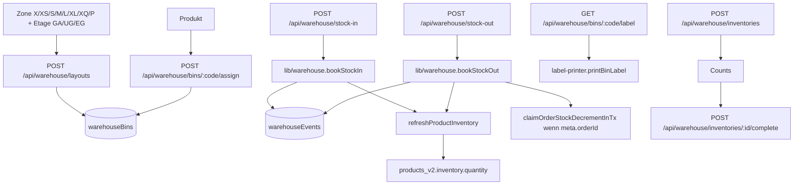

# Warehouse & BIN Management

## Was es macht

Verwaltet die physische Lager-Topologie (Zonen, Etagen, Gänge, Regale, Ebenen) und die Zuordnung von Produkten zu BINs (Lagerplätze). Stellt Stock-In/Stock-Out APIs bereit, generiert druckbare BIN-Labels (PDF + ZPL), unterstützt Container-Hierarchie (BIN-in-BIN) und Inventur-Workflow.

## Wie es funktioniert

### Topologie

`backend/lib/warehouse.js`:

- **Zonen**: `X | XS | S | M | L | XL | XQ | P` (Größen-/Spezial-Zonen)
- **Etagen**: `GA | UG | EG`
- **Gänge**: `1..10`
- **Regale**: `1..15`
- **Ebenen**: `A..G`

BIN-Code-Format: `{Zone}-{Etage}-{Gang}-{Regal}-{Ebene}` (z. B. `M-EG-3-7-B`).

### Storage-Hierarchie

- `warehouseBins` Collection — pro BIN ein Doc mit `products[]`, `firstStoredAt`, `lastUpdatedAt`, optional `parentBin`.
- Container-Logik: BIN kann Sub-BINs enthalten (`bins/:code/containers`), genutzt für Versandkartons/Rollis.
- Per Produkt: `products_v2.storage.binCode` (Primary) und `products_v2.storageBins[]` (Multi-Bin).

### Stock-In/Stock-Out

- `bookStockIn(productId, binCode, qty, meta)` schreibt Event + ruft `refreshProductInventory()`.
- `bookStockOut(productId, binCode, qty, { orderId, flow })` — bei `flow:'pick'` und `meta.orderId` MUSS `claimOrderStockDecrementInTx()` in derselben Transaction aufgerufen werden (CLAUDE.md Punkt 13, siehe `stock-management.md`).
- `refreshProductInventory(productId)` aggregiert über alle BINs den Bestand und schreibt nach `products_v2.inventory.quantity` (über `saveProductV2()`).
- **Wichtig**: `refreshProductInventory` legt **keine** neuen Produkt-Dokumente an — wenn die Doc-ID nicht existiert, wird geskippt (Schutz vor Stub-Docs).

### Zonen entfernen

In der Lager-Struktur kann eine ausgewählte Zone/Etage über „Zone löschen“ entfernt werden, auch wenn bereits null BINs existieren. Alle zugehörigen BINs und Behälter müssen leer sein. Der neue Pfad `deleteWarehouseZone()` liest und löscht Zone/BINs samt Audit in einer Transaktion; Vorprüfung allein berechtigt nicht zur Löschung. Die alten Gang-/Regal-/Ebenenpfade bleiben unverändert. Details zu Tenant-Altbeständen, Fehlern und API-Vertrag: [Warehouse-API](../09-api/warehouse.md).

### Zonenübersicht

`listWarehouseZones()` berechnet Gänge, Regale, Ebenen, BIN-Anzahl und Stückzahl aus den bereits abgefragten tatsächlichen BIN-Dokumenten. Historische `warehouseZones`-Zusammenfassungen können nur den letzten Generierungsaufruf enthalten und werden für diese Werte ignoriert. Behälter zählen zu den gesamten BINs, werden zusätzlich getrennt von den Lagerplätzen ausgewiesen. Regalanzahl zählt Gang/Regal-Paare, nicht nur unterschiedliche Regalnummern. Dies ist eine reine Anzeigekorrektur ohne Bestandsbuchungen oder Datenmigration. Regression: `backend/__tests__/warehouse-zone-summary.test.js`.

### BIN-Labels

`backend/services/label-printer.js`:

- PDF-Labels für einzelne BINs oder Bulk (`bins/labels.pdf`).
- ZPL-/PNG-Optionen für Label-Drucker.
- Endpoints: `GET /api/warehouse/bins/labels` (JSON), `GET /api/warehouse/bins/:code/label` (PDF), `POST /api/warehouse/bins/labels.pdf` (Bulk).

### Inventuren

- `POST /api/warehouse/inventories` — Anlegen mit Filter (Zone/Etage/BIN-Range).
- `POST /api/warehouse/inventories/:id/counts` — Soll-Ist-Erfassung pro BIN.
- `POST /api/warehouse/inventories/:id/complete` — Abschluss + Differenz-Buchung.

## Code-Pfade

**Backend:**
- `backend/lib/warehouse.js` — `bookStockIn`, `bookStockOut`, `refreshProductInventory`, `buildProductKeySet`, `binEntryMatchesKeySet`, BIN-CRUD
- `backend/lib/order-stock-claim.js` — `claimOrderStockDecrementInTx`
- `backend/routes/warehouse.js` — REST-API (~30 Endpoints)
- `backend/services/label-printer.js` — PDF/ZPL-Label-Generation
- `backend/services/scanner.js` — Barcode-Scanner-Workflow
- Tests:
  - `backend/__tests__/warehouse-containers.test.js`
  - `backend/__tests__/warehouse-delete.test.js`
  - `backend/__tests__/warehouse-matching.test.js`

**Frontend:**
- `components/WarehouseView.tsx` — Hauptseite (Zonen-Tree + BIN-Inhalte)
- `components/warehouse/WarehouseInventoryTab.tsx` — Inventur-Workflow
- `components/warehouse/WarehouseMovementsTab.tsx` — `warehouseEvents`-Log
- `components/warehouse/WarehouseSettingsView.tsx` — Layout-Konfiguration
- `components/InventoryView.tsx` — Aggregierte Bestands-View

### Datenmodell

| Collection | Zweck |
|---|---|
| `warehouseZones` | Konfigurierte Zonen (`code`, `etage`, `gangs[]`) |
| `warehouseBins` | BIN-Inhalte (`code`, `products[]`, `parentBin?`) |
| `warehouseEvents` | Append-only Bewegungs-Log |
| `inventories` | Inventur-Belege |

## Feature-Flags

| Flag | Default | Wirkung |
|---|---|---|
| `USE_PRODUCTS_V2` | `true` | Schreibziel `products_v2` (sonst `products`) |
| `STORAGE_BUCKET` | `prodsandjobs` | GCS für Inventur-Reports |

## API-Endpoints

Verweis auf `docs/kb/09-api/` (TBD). Auswahl aus `backend/routes/warehouse.js`:

- `GET  /api/warehouse/zones` — Zonen-Liste
- `POST /api/warehouse/layouts` — Layout (Zone/Etage/Gänge/Regale/Ebenen) anlegen
- `DELETE /api/warehouse/layouts/:zone/:etage` — vollständige leere Zone, Vorprüfung standardmäßig, Löschung nur mit `confirm=1`
- `DELETE /api/warehouse/layouts/:zone/:etage/gangs/:gang(/regale/:regal(/ebenen/:ebene))` — Layout-Teile löschen
- `GET  /api/warehouse/zones/:zone/:etage` — Slice-Anzeige
- `GET  /api/warehouse/bins/labels` (JSON) / `.pdf` — BIN-Labels (Bulk-PDF)
- `GET  /api/warehouse/bins/:code` — BIN-Inhalt
- `GET  /api/warehouse/bins/:code/label` — Einzel-Label
- `POST /api/warehouse/bins/:code/assign` — Produkt zuordnen
- `DELETE /api/warehouse/bins/:code/products/:productId`
- `GET/POST /api/warehouse/bins/:code/containers` — Sub-BIN-Logik
- `DELETE /api/warehouse/bins/:code/containers/:childCode`
- `POST /api/warehouse/stock-in` / `stock-out`
- `POST /api/warehouse/refresh-inventory`
- `GET/PUT /api/warehouse/settings`
- `GET  /api/warehouse/movements` — `warehouseEvents` Log
- `GET/POST /api/warehouse/inventories(/:id)` — Inventuren
- `POST /api/warehouse/inventories/:id/counts` — Counts
- `POST /api/warehouse/inventories/:id/complete` — Abschluss

Auth: `warehouse.read|write`.

## UI-Pages

Verweis auf `docs/kb/05-pages/` (TBD).

- `/warehouse` → `WarehouseView`
- `/warehouse/inventories` → Inventur-Tab
- Mobile: Bottom-Tab "Lager" mit Scanner-Workflow

## Spec

TBD — keine Stand-alone-Spec ("WH-001" existiert nicht in `docs/features/`). Verhalten ist durch Code + `CLAUDE.md` Punkt 13 (Single-Writer-Invariant) definiert.

## Bekannte Issues

### Neutraler Umzug ohne Lagerplatz (22.09.2026)

Ein expliziter Umzug ohne Ziel-BIN entfernt nur die Lagerzuordnung; `inventory.quantity` und das Lagerbuch bleiben unverändert. Bereits gezählte, unzugeordnete Einheiten stehen in `ops.relocation.unassignedQuantity`. Reguläres Stow (`source=api`, `action=stock-in`, ohne Order-/Retouren-/Inventur-/Repair-Kontext) verbraucht diesen Wert zuerst und bucht nur den darüber hinausgehenden echten Zugang. Retouren/Recredits verbrauchen ihn nicht. Versand, Lagerabgleich und Produktspeicherung erhalten den Umzugsbestand; veraltete Refreshes dürfen frühere BIN-Zuordnungen nicht zurückschreiben.

Der eng begrenzte Operator [unassign-warehouse-zone.js](../../../backend/scripts/unassign-warehouse-zone.js) ist standardmäßig lesend und auf den freigegebenen Tenant `default`/Zone `X` begrenzt. Er erstellt vor `--apply` eine neue private Sicherungsdatei, prüft beide Zuordnungsseiten und schreibt unter Firestore-SKU-Locks alle Produkte/BINs, Delta-null-Ereignisse und den tenantgebundenen Beleg `warehouseRelocations/{tenantId}_{operationId}` in einer Transaktion. Produktpatches gehen über `saveProductV2` mit `warehousePatch`; Bestand/Inhalt sind dort nicht erlaubte Patchfelder. Verwaiste BIN-Einträge bleiben vollständig im Beleg `orphanEntries`, ohne künstliche Produktanlage oder stillen Mengenverlust. Andere Zonen und die leere Struktur bleiben erhalten.

**Rollback:** Solange `ops.relocation.unassignedQuantity > 0` existiert, nicht auf Code ohne diesen Umzugspfad zurückrollen. Ein Datenrückweg muss aktuelle Lagerbewegungen berücksichtigen und darf keine alte Sicherung blind überschreiben. Kein allgemeiner UI-Räumungsendpunkt wurde hinzugefügt.

TBD — laufende Bugs siehe `TASKS.md`.
