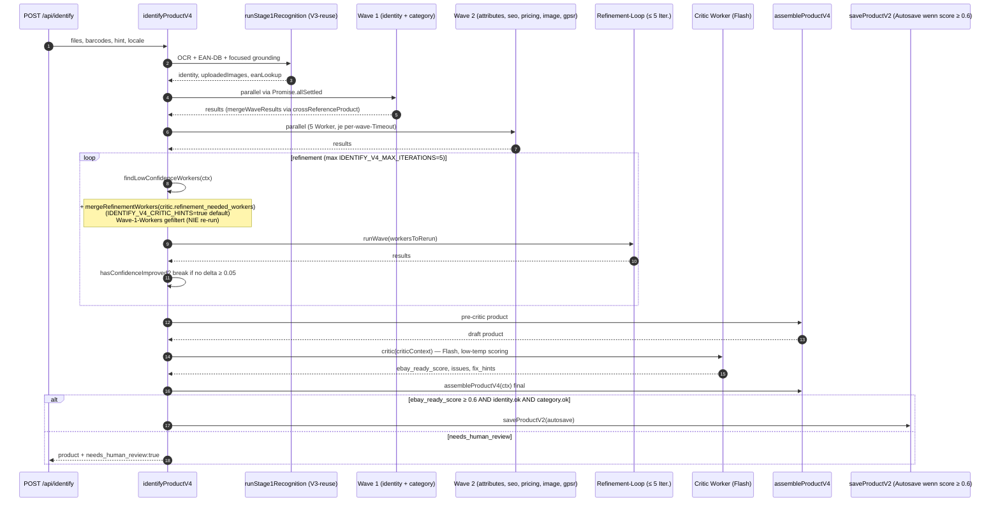
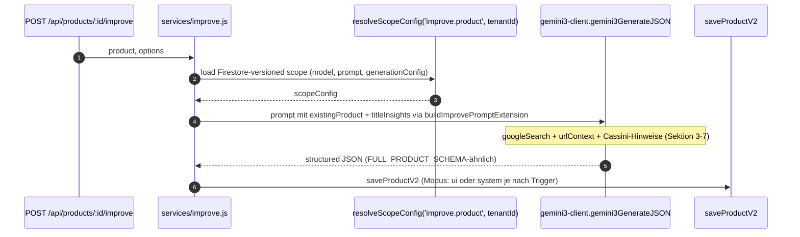
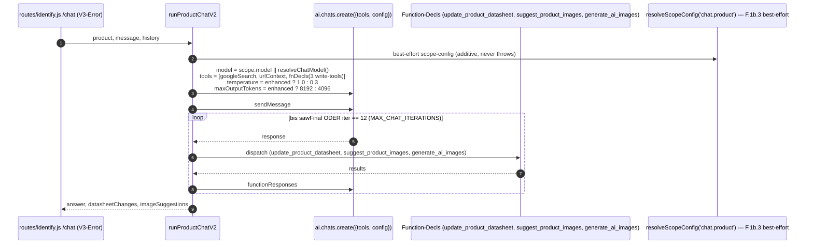
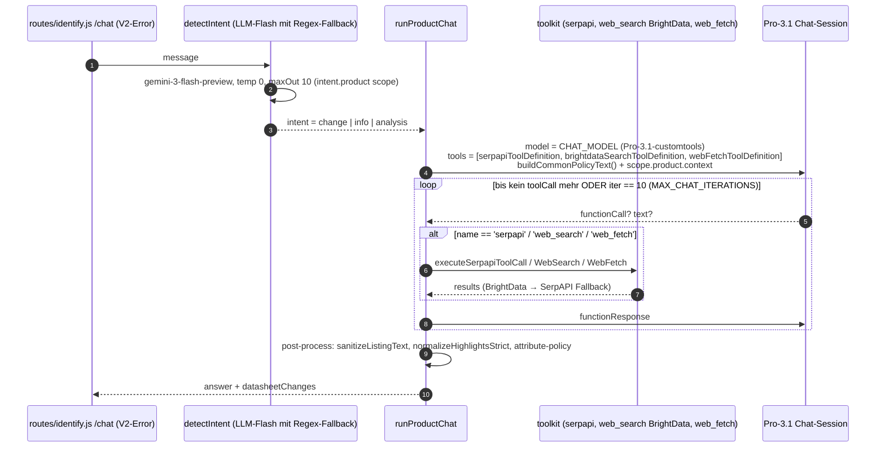
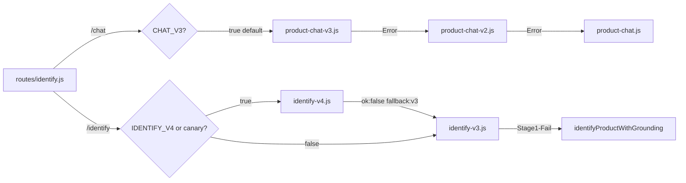

# Pipelines

> Die Kaskaden und Wave-Layouts der zentralen LLM-Pipelines. Jede Pipeline ist additiv hinter einem Feature-Flag (siehe [flags.md](flags.md)); bei Error fällt die Route auf die nächste Pipeline zurück.

---

## 1. Identify V4 — Orchestrator-Wave-Swarm

**Code:** [backend/services/identify-v4.js](../../../backend/services/identify-v4.js).
**Aktivierung:** `IDENTIFY_V4=true` (default OFF — Code-Default `identifyV4Enabled()` returnt `false` ohne explizites Opt-in). Zusätzlich gibt es `IDENTIFY_V4_CANARY_RATE` und `IDENTIFY_V4_CANARY_TENANTS` für Canary-Rollout in `routes/identify.js`.

**Kernidee:** Identify wird in Domain-Worker zerlegt, die in parallelen Waves laufen. Ein Critic (Flash-Modell) scort die assembled-Produktqualität; bei niedriger Confidence werden gezielt einzelne Worker neu gestartet. Wave 1 (`identity`+`category`) ist Foundation und wird NIE re-run; Wave 2 + Refinement bearbeiten die übrigen 5 Domänen.

### Sequenz



### Wichtige Konstanten

| Konstante | Wert | Quelle |
|---|---|---|
| `DEFAULT_MAX_ITERATIONS` | `5` (ENV `IDENTIFY_V4_MAX_ITERATIONS`) | [identify-v4.js:48](../../../backend/services/identify-v4.js) |
| `DEFAULT_WAVE_TIMEOUT_MS` | `60000` (ENV `IDENTIFY_V4_WAVE_TIMEOUT_MS`) | [identify-v4.js:49](../../../backend/services/identify-v4.js) |
| `DEFAULT_PIPELINE_TIMEOUT_MS` | `180000` (ENV `IDENTIFY_V4_TIMEOUT_MS`) | [identify-v4.js:50](../../../backend/services/identify-v4.js) |
| `AUTOSAVE_MIN_SCORE` | `0.6` (Critic-Schwellwert für Autosave) | [identify-v4.js:56](../../../backend/services/identify-v4.js) |
| `WAVE_1_WORKERS` | `['identity','category']` (immutable, nie re-run) | [identify-v4.js:106](../../../backend/services/identify-v4.js) |
| `CONFIDENCE_THRESHOLD` | `0.75` (Felder unter Schwelle triggern Refinement) | [identify-v4.js:102](../../../backend/services/identify-v4.js) |

### Worker-Registry

| Domain | Datei | Modell |
|---|---|---|
| `identity` | [lib/identify-workers/identity-worker.js](../../../backend/lib/identify-workers/identity-worker.js) | Pro-3.1 |
| `category` | [lib/identify-workers/category-worker.js](../../../backend/lib/identify-workers/category-worker.js) | delegiert an `services/category-resolver.js` |
| `attributes` | [lib/identify-workers/attributes-worker.js](../../../backend/lib/identify-workers/attributes-worker.js) | Pro-3.1 |
| `seo` | [lib/identify-workers/seo-worker.js](../../../backend/lib/identify-workers/seo-worker.js) | deterministic (`lib/seo-title-builder.js`, `seo-description-builder.js`) — kein direkter Gemini-Call |
| `pricing` | [lib/identify-workers/pricing-worker.js](../../../backend/lib/identify-workers/pricing-worker.js) | `lib/sweet-spot-pricer.js` |
| `image` | [lib/identify-workers/image-worker.js](../../../backend/lib/identify-workers/image-worker.js) | `lib/image-enhance.js` (Pro-Image + Flash) |
| `gpsr` | [lib/identify-workers/gpsr-worker.js](../../../backend/lib/identify-workers/gpsr-worker.js) | `lib/gpsr-manufacturer-registry.js` + `gpsr-web-fallback.js` |
| `critic` | [lib/identify-workers/critic-worker.js](../../../backend/lib/identify-workers/critic-worker.js) | **Flash** (`gemini-3-flash-preview`, `temperature: 0.1`) |

### Fallback-Verhalten

Bei jedem Fehler (Stage1-Failure, Pipeline-Timeout) liefert die Pipeline ein `{ ok:false, error, fallback:'v3' }`-Objekt zurück — die Route ([routes/identify.js](../../../backend/routes/identify.js)) kann dann V3 starten. V4 wirft NIE, der Critic-Step ist in eigenem try/catch.

---

## 2. Identify V3 — Multi-Stage Pipeline

**Code:** [backend/services/identify-v3.js](../../../backend/services/identify-v3.js).
**Aktivierung:** `IDENTIFY_V3=true` (default an — Fallback hinter V4, produktiv).

### Sequenz

```mermaid
sequenceDiagram
  autonumber
  participant Caller as POST /api/identify
  participant V3 as identifyProductV3
  participant S1 as Stage 1 Recognition
  participant S2 as Stage 2 Enrichment (parallel)
  participant S3 as Stage 3 Content Generation
  participant S4 as Stage 4 Validation
  participant S4b as Stage 4b Cross-Reference (STAGE4_CROSS_REFERENCE=true)
  participant Out as Canonical Product

  Caller->>V3: files, barcodes, locale, hint
  V3->>S1: runStage1Recognition (OCR + EAN-DB + focused grounding)
  S1-->>V3: identity, barcodes, uploadedImages, webImageUrls
  V3->>S2: runStage2Enrichment (parallel: category-resolver, weight-web-lookup, gpsr-web-fallback, ebay-title-insights, pricing, image-search)
  S2-->>V3: category, pricing, gpsr, titleInsights, gpsrWebFallback
  V3->>S3: runStage3ContentGeneration (Pro-3.1, context-rich; agentic loop wenn STAGE3_AGENTIC=true)
  S3-->>V3: title_ebay, description_ebay, item_specifics, gpsr_*
  V3->>V3: assembleProduct(productId, s1, s2, s3) + GPSR-Consensus (IDENTIFY_V3_GPSR_CONSENSUS)
  V3->>S4: runStage4Validation (overall_score, field_confidence, marketplace_readiness)
  V3->>S4b: runStage4CrossReference (additive, gated)
  V3-->>Out: product + ops.data_quality.identify_v3
```

### Stage-Detail

| Stage | Modell-Call | Wichtigste Sub-Module |
|---|---|---|
| **Stage 1** Recognition | `identifyProductFocused()` in [gemini3-client.js:767](../../../backend/lib/gemini3-client.js), Schema `RECOGNITION_SCHEMA` | OCR (`lib/identify-v3-stage1.js`), EAN-DB-Lookup (`lib/ean-database.js`), focused grounding |
| **Stage 2** Enrichment | meist NICHT-LLM (Resolver/Web-Fallback) | `services/category-resolver.js`, `lib/weight-web-lookup.js`, `lib/gpsr-web-fallback.js`, `lib/ebay-browse-title-insights.js` |
| **Stage 3** Content Generation | `generateProductContent()` in [gemini3-client.js:874](../../../backend/lib/gemini3-client.js), Schema `CONTENT_SCHEMA`. Agentic Variante: [lib/identify-v3-stage3-agentic.js](../../../backend/lib/identify-v3-stage3-agentic.js) (Multi-Tool-Loop `research` + `write_datasheet`). 3-Tier-Fallback: agentic → single-shot → V2-record | required-aspect repair (`STAGE3_ASPECT_REPAIR=true`) |
| **Stage 4** Validation | rein synchron — custom Field-Scoring + `marketplace_readiness` | [lib/identify-v3-stage4.js](../../../backend/lib/identify-v3-stage4.js) |
| **Stage 4b** Cross-Reference | nutzt `lib/cross-reference.js` + `lib/confidence-scoring.js` mit `SOURCE_WEIGHTS` | additiv, mutiert die `resolved`-Werte NICHT — surfacet Conflicts als `product.notes.warnings` |

### Identify-Grounding (V2-Single-Call) — Legacy

`identifyProductWithGrounding()` in [gemini3-client.js:611](../../../backend/lib/gemini3-client.js) ist die single-call Variante mit `FULL_PRODUCT_SCHEMA` + Google Search Grounding + urlContext (gated `IDENTIFY_URL_CONTEXT`). Wird als V3-Stage-1-Fallback genutzt sowie hinter Flag `CHAT_GROUNDING=true` als V2-Identify-Pfad. **Default-Modell-Konstante in dieser Datei: `'gemini-3-pro-preview'`**, das via `resolveModel()` automatisch auf `gemini-3.1-pro-preview-customtools` umgebogen wird.

---

## 3. Improve — Datasheet-Verbesserung

**Code:** [backend/services/improve.js](../../../backend/services/improve.js).
**Aktivierung:** Aufruf via Routes (Bulk-Improve / Single-Improve). Nutzt `llmScopeId: 'improve.product'` aus `lib/llm-config.js` — Modell, Temperature, Prompt kommen aus dem Scope.



`buildImprovePromptExtension(ctx)` in [gemini3-client.js:537](../../../backend/lib/gemini3-client.js) erzeugt den Cassini-Optimierungs-Block mit Top-Keywords, Wettbewerber-Titeln und HTML-Beschreibungs-Anforderungen.

---

## 4. Chat V3 — Context Circulation (Default-Pipeline)

**Code:** [backend/services/product-chat-v3.js](../../../backend/services/product-chat-v3.js).
**Aktivierung:** `CHAT_V3` default ON (`chatV3Enabled()` returnt `true` ohne ENV-Override — siehe [product-chat-v3.js:96](../../../backend/services/product-chat-v3.js)).

**Kernidee:** EIN Gemini-Chat-Session mit `googleSearch + urlContext + 7 atomic-tools + 2 write-tools` als Tools — Pflicht-Finalisierung jedes Turns mit `update_product_datasheet` (sonst sieht der User keinen "Übernehmen"-Button). Cross-Reference + Confidence-Scoring laufen **nach** der LLM-Session aus den gesammelten Tool-Evidence-Rows.

```mermaid
sequenceDiagram
  autonumber
  participant UI as POST /api/identify/chat
  participant V3 as runProductChatV3
  participant Chat as ai.chats.create({tools, config})
  participant Tools as atomic-tools executors
  participant Sanitizer as sanitizeDatasheetChangeV3
  participant CR as crossReferenceProduct + aggregateProductConfidence

  UI->>V3: product, message, history, attachments
  V3->>V3: buildSystemPromptV3(product) + scopeConfig (chat.product)
  V3->>Chat: model = gemini-3.1-pro-preview-customtools<br/>tools = [googleSearch, urlContext, fnDecls(7 atomic + update_product_datasheet + suggest_product_images)]<br/>thinkingConfig high + includeThoughts
  V3->>Chat: sendMessage(userParts)
  loop bis kein functionCall mehr ODER iter == 10 (DEFAULT_MAX_ITERATIONS)
    Chat-->>V3: response (functionCalls? thoughts? grounding?)
    V3->>V3: emitThoughts → onProgress 'thinking'
    V3->>V3: collectGrounding → onProgress 'grounding'
    V3->>Tools: dispatch in parallel (eigene Executors für update_product_datasheet + suggest_product_images; atomic-tools für lookup_gtin etc.)
    Tools-->>V3: { ok, source, data, confidence, meta }
    V3->>Sanitizer: sanitizeDatasheetChangeV3(args) Whitelist-Filter
    V3->>Chat: functionResponses zurück
  end
  V3->>CR: extractEvidenceFromToolResult → rows + citations
  V3->>CR: crossReferenceProduct(draft, rows) + aggregateProductConfidence
  V3-->>UI: { datasheetChanges, imageSuggestions, evidence, readyForPublish, needs_human }
```

### Wichtige Eigenschaften

- **WRITE_TOOL Pflicht:** `update_product_datasheet` MUSS am Ende jedes Turns aufgerufen werden. Wenn das Modell nur recherchiert (`searchOnlyIters` > `SOFT_RESEARCH_LIMIT=3`), wird der Modus auf `functionCallingConfig.mode='ANY' + allowedFunctionNames=['update_product_datasheet']` umgeschaltet (Anti-Looping).
- **Sanitizer:** [product-chat-v3.js:250](../../../backend/services/product-chat-v3.js) — Whitelist auf Top-Level (`summary`, `title`, `confidence`, `identity`, `short_description`, `key_features`, `attributes`, `gpsr`, `pricing`, `notes`), Identity-Fields (ean/gtin/upc/mpn/brand/clear), GPSR-Fields, Notes-Fields.
- **Retries:** `withGeminiRetryV3` mit per-attempt-Timeout (default 30 s), Backoff `[1s, 3s, 8s]`. Worst-Case 4 × 30 s + Backoffs.

---

## 5. Chat V2 — Grounding + Function-Decls

**Code:** [backend/services/product-chat-v2.js](../../../backend/services/product-chat-v2.js).
**Aktivierung:** Cascade-Fallback wenn V3 Error (oder `?pipeline=v2` explizit gesetzt). `CHAT_V2_ENHANCED=true` (default) aktiviert die Gemini-3-Härtungen (`urlContext`, Temperature 1.0, Thinking, 8192-Tokens, 4×30s-Retry).



V2 hat KEINE atomic-tools — die Recherche läuft komplett über `googleSearch` + `urlContext` (native Gemini-Tools) plus die write-Function-Decls.

---

## 6. Chat Legacy — BrightData/SerpAPI + Gemini-Agentic-Loop

**Code:** [backend/services/product-chat.js](../../../backend/services/product-chat.js).
**Aktivierung:** Letzter Fallback in der Cascade (V3 → V2 → Legacy). `CHAT_LEGACY_ENHANCED=true` (default) aktiviert Härtungen: ASIN-Detection, Amazon-Routing via SerpAPI `engine='amazon'`, `forceOneEvidencePass` für ALLE Intents (nicht nur `change`), Thinking-Modus, erweitertes Evidence-URL-Scoring.



> **TABU-Hinweis:** BaseLinker ist verboten (CLAUDE.md Punkt 9). Die Legacy-Pipeline nutzt **SerpAPI + BrightData** als externe Such-Provider — nicht BaseLinker. BrightData wird per Sprint-1-Plan langsam abgelöst (siehe [cost-and-budgets.md](cost-and-budgets.md), `external_api_calls`-Tracking).

---

## 7. Fallback-Cascade — Wer fällt wohin?



**Telemetrie der Fallbacks** ist im Hardening-Plan als TODO gelistet (Wave 4 — `chat_pipeline_fallbacks`-Collection). Aktuell wird nur per `console.warn` geloggt; ein dedizierter Counter existiert NICHT.
