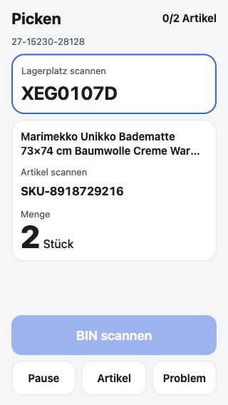
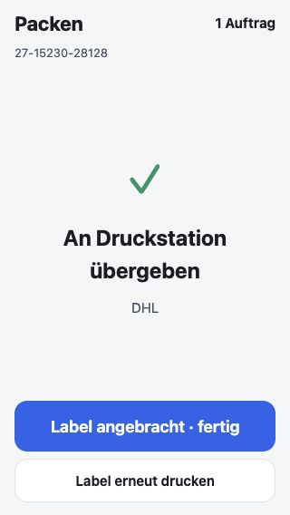
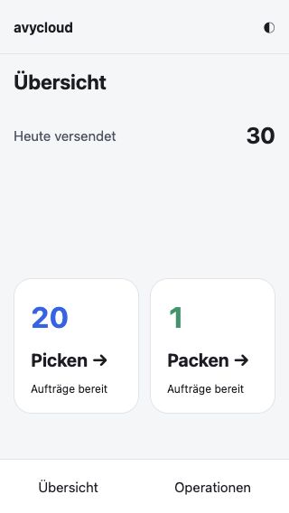

# Handheld / Team-Pick / Druck — Releaseprüfung

## Aktualisierung 08.10.2026

**Ziel bestätigt: Windows `192.168.178.61`, durchgehend laufender Rechner.** PR [#32](https://github.com/kulacogo/avycloud/pull/32) enthält jetzt auch einen Windows-Adapter und `install-windows.ps1` / `Einrichten.cmd`. Rollenformate aus dem tatsächlichen Windows-Treiber, SumatraPDF 3.6.1 mit explizitem `paperkind`, dauerhafte Anwendungsquittung und bestehendes Journal. Task Scheduler startet als LocalService beim Booten, auch ohne interaktive Anmeldung. Privates ProgramData-Verzeichnis und lokal eingegebenes AvyCloud-Passwort; gespeichert wird ausschließlich das Refresh-Token. Node/Sumatra kommen aus fixierten Hersteller-Downloads mit SHA-256-Prüfung.

**Installation auf dem Zielrechner weiterhin offen.** Netzwerkprüfung: SMB/445 erreichbar, aber ohne bestehende Anmeldung abgelehnt; SSH/22, RDP/3389 und WinRM/5985/5986 nicht erreichbar. Keine Fernwartungs-App auf dem Mac gefunden. Betreiber nach vorhandenem Fernzugang bzw. lokalem Setup-Start gefragt. Keine Passwortabfrage im Chat. Kein Windows-Login, keine Treiberinstallation oder physische Druckabnahme behaupten.

Neu geprüft: 31 Agenttests inklusive Windows-Adapter und tatsächlichem Dienstkonto-Verifikationsablauf mit Abhängigkeitssimulation; beide PowerShell-Dateien mit Microsoft PowerShell 7.6.6 geparst. Zwei Test-PDFs mit exaktem Rollenmaß durch Backendtests geprüft und gerendert visuell kontrolliert. **Kein Windows-Runtime-Test**, weil Zielzugang fehlt. Setup druckt die beiden Testetiketten unter LocalService und wartet auf Sicht-/Scanbestätigung, bevor es Produktionsjobs zulässt.

Main einschließlich eBay-Tagesbudget und Filter „Erfasst von“ bis `04f35572` integriert. Letzter Gesamtlauf: **5.915 Backendtests / 516 Dateien**, **575 Frontend-/Agenttests**, TypeScript und Vite-Build grün. Zwei anfängliche OAuth-Test-Timeouts kamen aus der neuen Budget-Datenbankabhängigkeit; inzwischen auf Main über dessen Test-Store-Konfiguration behoben. Kein zusätzlicher Produktionsfix oder Test-Timeout-Override in diesem Release.

Lesend 08.10.2026, 16:49 MESZ: `print_agents=0`, offene Druckjobs 0, offene confirmed/picking-Aufträge 6, verwaltete Picks 0, alte Teilpicks 0. Web `01831-nf8`, Worker `00286-pqj` kurz zuvor Ready/100 %. **Unser Release noch nicht deployed.** Vor tatsächlichem Cutover Werte erneut prüfen. Ohne eingerichtete Station würde der neue Packabschluss blockieren; deshalb bleibt die Stationsabnahme Voraussetzung.

Die folgenden Werte beschreiben die Erstprüfung vom 07.10.; die Aktualisierung oben hat Vorrang.

Stand: 2026-10-07, ca. 00:50 Europe/Berlin. **Implementiert und lokal geprüft, noch nicht produktiv.** Branch `codex/handheld-team-print-20261006`, Basis `0e89b058555d950442f54f2d4ab948601f2fd3ba`. Auftrag: neue übersichtliche Handheld-UI, integrierter Labeldruck und paralleles Picken durch Mitarbeiter auf Produktion bringen.

## Produktionsvoraussetzung noch offen

Die echte Druckstation ist nicht eingerichtet. Lesend am 07.10. bestätigt: `print_agents` im Tenant `default` leer; keine offenen Druckjobs. Zielrechner und verwendetes AvyCloud-Konto wurden beim Betreiber angefragt. Keine Zugangsdaten in Chat oder Git speichern. Vor Produktivschaltung: Rechner/Konto einrichten und beide Rollen physisch mit TEST-Druck prüfen. Der neue Agent wartet vor dem Claim auf ein Backend mit Protokoll 2; gegen das alte Backend holt er keine Jobs ab. Erst nach dieser Vorbereitung kontrolliert Merge/Deploy; unmittelbar danach mindestens zwei frische Protokoll-2-Heartbeats und die neue Warteschlange prüfen. Eine produktive Offline-Packstation wäre keine Erfüllung des Auftrags.

## Änderung und Grenzen

- Handheld-Home mit Arbeitsaktionen; Operationsauswahl als vier Karten; Pick/Pack im ganzen Viewport, klare Stückzahl, einzeilige Codes, Hauptaktion unten.
- Ein ganzer Auftrag pro Mitarbeiter, atomare serverseitige Zuweisung, zentraler Mengenfortschritt, stabile Buchungsquittungen. Pause und Verbindungsverlust geben Teilware nicht automatisch frei. Wechsel auf ein anderes Gerät desselben Kontos muss ausdrücklich bestätigt werden.
- Desktop-Pick nutzt denselben Vertrag. Frische BIN-Mengen vermeiden einen zweiten lokalen Abzug bereits gebuchter Ware.
- Alle Packpositionen bestätigen; Gewicht/Versandwahl; vorhandenes Label direkt an passende Druckstation. Kein Android-Druckdialog in diesem Ablauf.
- Initiale Druckjobs werden pro Sendung dedupliziert; lokale CUPS-Quittungen überleben Neustarts. Unklare Ausgabe erfordert Prüfung und ausdrücklichen Nachdruck. Nachdruck erstellt keinen neuen Versand.
- `done` bedeutet CUPS-Annahme. Sichtbarer Abschluss verlangt „Label angebracht · fertig“. Kein physischer Drucknachweis aus den Softwaretests ableiten.
- Eine Übergabe teilgepickter Aufträge an **andere Benutzer** sowie eine automatische Fehlmengen-/Rücklagerungsbuchung sind nicht Bestandteil dieser Version. „Problem“ pausiert, korrigiert keinen Bestand.
- Verlorene Versandantwort: offene Aufgabe bleibt gespeichert; vorhandene Sendung erneut abrufen, nicht blind Porto neu kaufen. Fehlt tatsächlich eine Sendung, ist Prüfung am Packtisch erforderlich.

## Prüfung

| Prüfung | Ergebnis |
|---|---|
| Unveränderte Basis | Backend 5.721 Tests / 496 Dateien; Frontend 547 Tests; Build erfolgreich |
| Aktueller Backend-Gesamtlauf | **5.758 Tests / 502 Dateien erfolgreich**, `npm test -- --maxWorkers=4` |
| Frontend einschließlich Agent | **556 Tests erfolgreich**, `npm test` |
| TypeScript | `npx tsc --noEmit` erfolgreich |
| Frontend-Build | `npm run build` erfolgreich |
| Schutz der Testläufe | Fiktives GCP-Projekt `avycloud-local-test`, `FIRESTORE_EMULATOR_HOST=127.0.0.1:1`, Credentials `/dev/null`; keine Tests gegen Produktion |
| Konkurrenz / Eigentümer | Parallele Service- und HTTP-Claims ergeben verschiedene Aufträge; Body kann Actor/Tenant nicht überschreiben; falscher Besitzer/Scanner/Token abgelehnt |
| Bestand | Echte Stock-out-Funktion gegen transaktionale Mocks: verlorene Antwort führt zu nur einer BIN-Abbuchung; fremder Mitarbeiter und Übermenge vor Schreiben blockiert |
| Abschluss / Versand | Teilpick und geänderte Positionen blockieren Abschluss; Versandprüfung vor SendCloud-Zugriff; fehlgeschlagener Pack-Status wird nicht als Erfolg behandelt |
| Druck | Doppelte initiale Requests erzeugen einen Job; fremde/stale Quittungen abgelehnt; alte Agenten HTTP 426; verlorene Antwort druckt keine zweite Kopie; stornierte Labels abgelehnt |
| Installation | Laufzeit unabhängig vom Worktree, Refresh-Sitzung statt gespeichertem Passwort, korrekte Rechte/Medienauswahl |
| Browser | Tatsächliche React-Komponenten mit isolierten Fixtures, 320×568 und 360×640; Pick, Teilfortschritt, Pause/Fortsetzen, Pack 2 Positionen/3 Stück, Gewicht, Versand, simulierte Druckquittung, offene Labelaufgabe nach Reload; Desktop-Zuweisung bei 1024×800 |

Der erste volle Lauf unter gleichzeitig hoher lokaler CPU-Last enthielt vier 10-s-Timeouts in unveränderten Tests; gezielt und mit begrenzten Workern erneut grün. Ein Helper wurde zunächst als Testdatei eingesammelt und danach gemäß bestehendem `_*.js`-Ausschluss umbenannt. Keine Timeout-Grenzen oder Tests abgeschwächt. Neu hinzugefügte Regressionsfälle wurden vor den jeweiligen Korrekturen rot ausgeführt.

Bei 320×568: Dokumentbreite/Höhe genau Viewport, BIN/SKU `nowrap` ohne Überlauf. Hauptaktion 56 px, Sekundäraktionen 48 px, letzte Aktion endet bei y=554. Im Gewichtsmodal übernimmt „Schließen“ den Fokus; der versteckte Scanner-Eingang wird während Modal/Mengeneingabe entfernt, damit er den Fokus nicht stiehlt. Außerhalb bleibt der IME-Eingang für Android-Scanner erhalten. Echte PDA-Hardware, Handschuhbedienung und physische Ausgabe bleiben Teil der Inbetriebnahme; Browseremulation ersetzt sie nicht.

## Lesender Produktionsstand vor Freigabe

- Main unverändert `0e89b058…`.
- Web `product-hub-backend-01828-2bh`, Worker `product-hub-worker-00283-frq`, jeweils Ready und 100 % Traffic.
- 20 offene `confirmed`/`picking`-Aufträge im Tenant `default`; keine unklaren alten Teilpicks, keine ungültigen Positionen, keine neuen `pickWork`-Zuordnungen.
- Neue Order- und Druckabfragen funktionieren gegen vorhandene Indizes; kein Indexdeploy erforderlich.
- Keine Produktionsbestände, Auftragsstatus, Labels oder Rollen für Tests geändert. Geschützte Auth-/Infra-Dateien unberührt.

## Auslieferung und Rückweg

1. Druckrechner/Konto klären, lokale Sitzung im Terminal einrichten. Hardware/Medien prüfen. Auf dem alten Backend darf der Agent „wartet auf Protokoll 2“ melden; er übernimmt dort keine Aufträge.
2. Main und offene/teilgepickte Aufträge erneut lesen; keine unbekannte laufende Pickarbeit still übernehmen. PDAs nach Rollout neu laden.
3. PR erst nach Stationsvorbereitung und physischer Medienprüfung mergen. Bestehende Pipelines deployen Hosting, Web und Worker. Beide Cloud-Run-Revisions, CI, Hosting-Asset-Version, `/health`, `/ready` und Fehlerlogs prüfen. Anschließend neue Stations-Heartbeats und tatsächliche Queue-Übergabe abnehmen. Die Pipelines sind unabhängig: während des Versionswechsels keine laufende Pickarbeit; alte Clients müssen neu laden, da Buchungen ohne Zuordnung abgelehnt werden.
4. Gegenbeweis bei Fehlern: neue Arbeitsstarts stoppen. Bereits verwaltete Teilpicks nicht durch alte Clients buchen lassen. Alte Version kennt zentrale Pick-Quittungen nicht; deshalb kein unbedachter Backend-Rollback bei aktiven `pickWork`-Aufträgen. Additive Felder/Quittungen erhalten, Ware prüfen, gezielten Fix oder abgesprochenen kontrollierten Rückweg wählen. Allgemeine Mechanik: [Rollback](../../kb/04-deployment/rollback.md).
5. Station-Update erhält `journal/`; alte Protokoll-1-Agenten werden nicht weiterverwendet.

## Lokale Vorschau

```bash
npx vite --config tools/handheld-preview/vite.config.ts
```

`http://127.0.0.1:4180/`, nur Fixtures. `?reset=1` setzt die lokalen Testdaten zurück; `?offline=1` simuliert fehlende Station. Keine Verbindung zu echten Orders/Auth/Print-Jobs. Nicht als Produktionsfrontend ausliefern.




